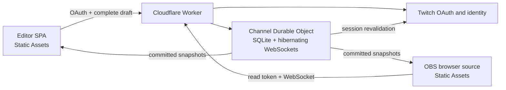

# Design: IRL Stream HUD Channel Capsule

Generated by `/office-hours` on 2026-08-28<br>
Branch: `main`<br>
Repo: `irl-stream-hud`<br>
Status: APPROVED<br>
Mode: Builder

## Problem Statement

IRL streams need an always-visible, fantasy-inspired unitframe that moderators can operate without controlling OBS. The overlay must show a configurable streamer identity, percentage-based health and resource bars, timed or untimed buffs and debuffs, an optional pet, and a compact guest group. Twitch-authenticated moderators and the broadcaster edit a local draft in a modern web UI and publish the complete state atomically to a transparent HTML browser source in OBS.

The first release is a manual real-time editor for a single configured channel. The second release adds compound IRL events and rules. The long-term target is an open IRL RPG engine that streamers deploy into their own Cloudflare accounts.

## What Makes This Cool

The broadcaster appears as a playable outdoor RPG character, but the operational model stays simple: a moderator changes a few percentages, selects recognizable status effects, and presses Save. The unitframe can move from an ornamental classic fantasy look to a compact or minimal modern look without changing its state. A configured companion and stream guests become actual party units, while the same open-source package can be themed for each deployment without forking its core.

## Product Phases

### V1a — Core manual realtime HUD

- Twitch authentication for broadcaster and moderators.
- Player frame, percentage bars, one production theme, effects, atomic Save, realtime OBS update, and last-state recovery.
- Absolute or absent effect expiry and the single featured-description invariant.
- Bounded player portrait upload.

V1a is implemented as four separately verifiable production slices rather than one cross-cutting build:

1. **Capsule foundation:** Worker project, shared state contract, SQLite-backed channel Durable Object, migrations, and integration-test harness.
2. **Authenticated state:** Twitch login and eligibility, Editor session, player/resource editing, atomic Save, revision conflicts, and audit metadata required by the pilot.
3. **Live channel:** Classic Remix overlay, hibernating WebSocket delivery, last-state recovery, token rotation, and the immediate global visibility command.
4. **Pilot completeness:** Timed or untimed effects, the single featured description, bounded player portrait upload, accessibility-critical states, and the operational rehearsal path.

Each slice must pass its own unit and Worker integration tests before the next begins. The fourth slice ends at the existing 30-minute rehearsal gate. Pet, group, the two additional themes, full Audit/Undo UI, complete onboarding, and public self-deployment polish remain V1b work and do not enter the V1a implementation merely because they share a component or state field.

### V1b — Complete public release

- Transparent OBS browser-source overlay.
- Modern web editor authenticated through Twitch.
- Broadcaster and every currently verified Twitch moderator have identical Editor access.
- Local draft plus one atomic Save action; intermediate typing or slider movement never reaches OBS.
- Configurable player identity, portrait, title, level, HP percentage, and resource.
- Optional configurable pet and compact guest group.
- Timed or untimed buffs/debuffs with one optional visible description.
- Three switchable original themes.
- Audit log and Undo.

V1a is deployed as a private production pilot before V1b begins. Promotion requires one 30-minute stream rehearsal with one moderator, ten successful atomic Saves, timer persistence across reconnect, and no unresolved severity-1 workflow failure. If those gates fail, V1a is corrected before committing effort to V1b. Public V1 includes V1b and the complete agreed product.

### V2 — Mod-controlled stream RPG

- Reusable actions such as “Mahlzeit verpasst” or “Pause am Lagerfeuer”.
- Each action can atomically change bars, add/remove effects, and update descriptions.
- Rules remain explicit and moderator-triggered; no automatic health inference from video.

### Target — Open IRL RPG engine

- Self-deployable channel capsules.
- Theme packs, effect packs, event packs, and documented extension points.
- Optional Twitch Extension using the same read API for genuine viewer hover and tooltips.

## Constraints

1. **Hard zero-cost target:** V1 must require no paid Cloudflare service. Static files are free and unlimited, while Worker and Durable Object operations remain quota-bounded. Exceeding the free dynamic quota may degrade service; the project does not claim unlimited dynamic usage. See [Workers pricing](https://developers.cloudflare.com/workers/platform/pricing/), [Static Assets billing](https://developers.cloudflare.com/workers/static-assets/billing-and-limitations/), and [Durable Objects pricing](https://developers.cloudflare.com/durable-objects/platform/pricing/).
2. **Self-hosted scaling:** Each streamer deploys a separate Cloudflare Worker and receives a separate free-tier allowance.
3. **No R2 in V1:** Small uploaded portraits are compressed client-side and stored as bounded blobs in the channel Durable Object.
4. **No Twitch Extension in V1:** OBS provides persistent visuals but cannot receive viewer pointer events. True viewer hover belongs to the later Twitch Extension.
5. **No copied Blizzard assets:** The hierarchy may evoke classic and modern MMORPG unitframes, but frames, icons, ornaments, and logos must be original.
6. **OBS placement:** The HUD begins near the top-left safe area. No buff, title, tooltip, or ornament may extend above its top boundary.
7. **No fine-grained permissions:** Broadcaster and verified moderators are Editors with full access. Everyone else is denied the admin UI.
8. **No per-second backend work:** Countdown presentation runs locally from an absolute timestamp.

## Premises

- Each streamer deployment is configured independently and is not a hard-coded product boundary.
- Engine logic, theme assets, and deployment-specific content remain separate.
- A channel capsule is single-channel by default; multi-channel hosted SaaS is outside V1.
- V1 state is moderator-entered, not inferred from cameras, wearables, Twitch chat, or OBS events.
- The primary admin user is a remote moderator operating from a desktop or laptop, not a companion walking beside the broadcaster. Mobile admin access is a fallback, not the primary live-control environment.
- Buffs and debuffs are original IRL status concepts. Their names, descriptions, timing, ordering, and icons are editable.
- UI themes affect presentation only. A theme switch never changes the underlying channel state.
- The editor may preview a local draft immediately. Only Save publishes a new state revision.

## Approaches Considered

### Approach A: Channel-specific single application

Fastest initial release, but it would hard-code the theme and content and create substantial migration work for the open engine.

### Approach B: Centrally hosted multi-streamer platform

Convenient onboarding, but all channels would share one free-tier allowance. It conflicts with the zero-cost constraint as usage grows.

### Approach C: Self-deployable Channel Capsule

A generic single-channel engine is deployed once per streamer. Each deployment supplies its own configuration and content, and owns its Cloudflare quota and Twitch application credentials.

## Recommended Approach

Use **Approach C**. It preserves the narrow V1 operational workflow while establishing the correct seams for V2 actions and the open-engine target. It is also the only approach that turns Cloudflare's free-tier quotas into a per-streamer rather than shared constraint.

The approved interaction reference is [the V4 HTML wireframe](../../design/irl-stream-hud-wireframe-v4.html). The wireframe validates layout and workflow only; emoji, CSS borders, colors, and placeholder portraits are not production art.

## What already exists

- The repository is plan-only: it contains this approved product/architecture specification and the functional [V4 HTML wireframe](../../design/irl-stream-hud-wireframe-v4.html), but no production application, component library, test suite, or deployment configuration yet.
- The V4 wireframe already demonstrates the top-left HUD geometry, player/pet/group composition, effect flyover, local draft workflow, and audit-log placement. Production work should reuse those interaction findings rather than its placeholder visual styling.
- The approved Modern Broadcast admin direction and its post-review desktop/mobile references were evaluated locally and are not versioned with the product.
- No `DESIGN.md` exists. Creating it from the approved direction is the first production-design task and blocks UI implementation.

## NOT in scope

- **Twitch Extension in V1:** true viewer hover and viewer-specific interaction remain a later client over the same read model; OBS is the persistent first surface.
- **Automatic gameplay inference:** camera analysis, wearables, Twitch chat commands, and OBS event automation remain outside V1 because moderators author state deliberately.
- **Fine-grained roles:** broadcaster and verified moderators share one Editor capability set; a permissions product would add operational complexity without solving the pilot need.
- **Centrally hosted multi-tenant SaaS:** every streamer owns one self-deployed capsule so usage and Cloudflare free-tier allowance remain isolated.
- **Full mobile setup:** mobile is an emergency Live Console; portraits, identities, group composition, theme/position, and token setup remain desktop-only in V1.
- **Admin light mode:** the production editor ships one deliberate dark mode; the three overlay themes remain independently selectable.
- **Copied game assets or exact WoW frames:** only the familiar unitframe hierarchy is referenced; all frame art, icons, Trail Mark details, and ornaments are original.
- **V2 actions and rules:** compound moderator actions and the broader open IRL RPG engine begin only after the manual V1 workflow passes the pilot gate.

## V1 User Experience

### Authentication

1. An Editor opens the admin URL and chooses “Mit Twitch anmelden”.
2. The Worker completes Twitch's server-side authorization-code flow.
3. The Worker identifies the user and verifies that they are either the configured broadcaster or currently moderate that channel.
4. An eligible user receives a secure Editor session; an ineligible user sees a clear access-denied page.
5. All Editors have identical capabilities.

Twitch authorization follows the [authorization-code flow](https://dev.twitch.tv/docs/authentication/getting-tokens-oauth). Moderator membership is checked through [Get Moderated Channels](https://dev.twitch.tv/docs/api/reference#get-moderated-channels). Maintained sessions validate tokens at startup and hourly as required by [Twitch token validation guidance](https://dev.twitch.tv/docs/authentication/validate-tokens).

### Editor bootstrap states

After authentication, the editor renders its final page geometry immediately as a neutral layout skeleton: left rail, top bar, preview region, live-control rail, and setup disclosures. Skeleton shapes communicate hierarchy only and contain no default names, percentages, effects, portraits, audit entries, or simulated connection status. The shell carries `aria-busy="true"`; every control and mutation remains disabled until the complete bootstrap envelope has been validated.

Bootstrap state, Editor identity, current revision, audit entries, Undo targets, limits, and CSRF token appear as one coordinated reveal. Portrait bytes may continue loading afterward, but deterministic placeholders preserve geometry and never block controls once the authoritative state is known. The editor does not render a cached admin snapshot as if it were current.

If bootstrap fails, the skeleton is replaced inside the existing shell by one focused error state: “Editor konnte nicht geladen werden.” It includes the server-safe reason when available, “Erneut versuchen”, and “Abmelden”. Retry starts a fresh bootstrap rather than reusing a partial envelope. No editor controls or stale values remain visible behind the error state.

### First-run setup checklist

Until the capsule has completed its first successful setup, the preview region includes a compact non-modal checklist above the video surface:

1. **OBS-Link erzeugen** — complete when the first overlay token is created.
2. **Overlay in OBS verbinden** — complete when a valid overlay WebSocket has connected at least once.
3. **Erste Änderung speichern** — complete when the first user-authored Save after the seeded default revision succeeds.

Each incomplete step links directly to the existing control that performs it. The checklist never blocks editing, dims the workspace, launches a tour, or introduces a separate setup page. Completed steps use text plus an icon rather than color alone. Once all three server-observed milestones are complete, the checklist disappears globally for every Editor and does not return after disconnects, token rotations, new moderator sessions, or browser storage cleanup. The milestones are capsule metadata outside `ChannelState`; recording them creates no visible state revision.

### Editing and atomic Save

1. The editor loads revision `N` and creates a local draft.
2. Text inputs, sliders, theme changes, group edits, and effect flyovers update only that draft and its local preview.
3. The interface clearly marks the draft as “noch nicht an OBS gesendet”.
4. Save submits the complete draft with `baseRevision: N`.
5. The Durable Object validates and stores it in one SQLite transaction, increments the revision, appends one audit entry, and broadcasts the committed snapshot.
6. OBS swaps to the new snapshot as one visual update.

The persistent top-bar publication state and Save action use this state machine:

| State | What the Editor sees | Controls | Save action |
|---|---|---|---|
| Clean | “Gespeichert · OBS aktuell” | Enabled | Disabled |
| Dirty | “Lokaler Entwurf · noch nicht an OBS gesendet” | Enabled | “Änderungen speichern” |
| Saving | “Wird gespeichert …” with restrained progress indication | Every mutating control temporarily disabled | Disabled and busy |
| Failed | “Nicht gespeichert” plus the safe server message | Re-enabled with the exact draft preserved | “Erneut speichern” |
| Conflict | Revision summary in the focused conflict dialog | Background controls disabled | Dialog actions only |

Save captures one immutable request snapshot and locks mutation until that request resolves. Success replaces the draft base with the committed revision, updates the audit log, announces the result through the live region, and returns to the persistent clean state without an ephemeral toast. A non-conflict error keeps every local value, restores focus to Save or the first invalid field as appropriate, and never changes the OBS preview. The moderator must explicitly retry; failed Saves are never queued.

If another Editor has already committed revision `N+1`, the stale Save is rejected with a conflict dialog. V1 offers “Neu laden” and “Trotzdem ersetzen”; it never silently overwrites a newer revision. A force replacement must name the exact newer revision shown in that dialog. If the current revision changes again before replacement, the server returns another conflict.

Undo targets a retained historical revision and submits both `baseRevision` and `targetRevision`. The default target is the current revision's immediate predecessor that differs in ordinary editor content. A successful Undo creates and publishes a new revision containing the target's editor content plus the latest committed `overlayEnabled` value and an `undo` audit record; it does not rewrite history or toggle global visibility. Visibility-only revisions are omitted from the Undo target list. A concurrent commit produces the same conflict response as Save.

### Editor connection loss

If the admin loses its backend connection, it enters a locked offline state rather than accepting more draft edits. Every input and mutating action, including Save, Undo, uploads, guest lookup, and effect editing, is disabled. A persistent high-contrast banner states “Offline – Bearbeitung pausiert; OBS wurde nicht geändert.” The current draft and preview remain visible but frozen so the moderator can still read the last values.

The frozen draft exists only in the current tab's memory. Closing or reloading the tab while disconnected may discard uncommitted changes; the banner says this explicitly without suggesting that work was saved. On reconnect, the editor fetches the current snapshot. If its base revision is still current, the controls unlock with the frozen draft intact. If another Editor committed meanwhile, the normal revision-conflict dialog appears before further editing; the client never queues or automatically publishes an offline mutation.

### OBS setup and token rotation

The top-bar OBS action reflects three explicit states:

1. **No token exists:** it reads “OBS einrichten”. A compact dialog explains the OBS browser-source URL, the `1920×1080` reference size, browser zoom `100%`, and transparent background. “OBS-Link erzeugen” creates the token only after confirmation and displays the plaintext URL once with a copy action.
2. **The current tab still holds the plaintext URL:** it reads “OBS-Link kopieren” and copies from `sessionStorage` without another server read.
3. **A token exists but this tab cannot reconstruct its plaintext URL:** it reads “OBS-Link neu erzeugen”. The confirmation states that the old OBS source will stop immediately and must be replaced with the new URL.

The OBS connection status in the left rail is always interactive and opens the same compact settings dialog. That dialog shows connected/disconnected state, token creation time, last successful use, and a clearly labeled “Token ersetzen” action. Rotation is therefore always available without adding a primary navigation page. It requires an explicit confirmation, creates and reveals one new plaintext URL, revokes the previous hash atomically, closes existing overlay sockets, and writes an audit entry.

A leaked overlay token remains read-only but is not harmless: unwanted requests or sockets could consume the capsule's free-tier budget. Invalid or revoked tokens receive no state payload and no WebSocket upgrade. Existing per-capsule overlay connection limits remain enforced, and repeated failed token use is rate-limited at the Worker boundary before any live overlay session is admitted.

The baseline uses Cloudflare's Worker Rate Limiting API before forwarding an overlay upgrade or token-authorized media request to the Durable Object. Requests with an invalid method, token length, token encoding, upgrade form, or oversized headers fail before either limiter. The Worker then applies both a capsule-wide admission limit keyed by `CAPSULE_ID` and a per-token limit keyed by `CAPSULE_ID` plus a SHA-256 fingerprint; raw overlay tokens never become rate-limit keys or log fields. Initial conservative values are 12 overlay admissions per 60 seconds per capsule and six per 60 seconds per token fingerprint. A rejection returns `429` with `Retry-After`, does not access the channel object, and leaves established sockets untouched.

These counters are deliberately treated as permissive, location-local abuse brakes rather than exact accounting. They protect the Durable Object and Twitch-facing work but cannot make hostile inbound Worker traffic free or guarantee protection from a distributed attack. A deployment with its own Cloudflare-managed domain may additionally configure the Free-plan WAF rate-limiting rule for overlay paths, but a custom domain is not required for the V1 capsule or its `workers.dev` baseline.

### Empty live controls

An absent stream component keeps its place in “Live-Steuerung” as one compact inline empty state rather than disappearing or showing disabled example controls:

- no effects: “Keine aktiven Effekte” with “Effekt hinzufügen”;
- no pet: “Kein Pet eingeblendet” with “Pet einrichten”;
- no guests: “Keine Gäste im Stream” with “Gast hinzufügen”.

Each action opens the existing anchored flyover or the matching “Einrichten” disclosure without navigating away. When the component becomes active, its real live controls replace the empty state in the same position. Empty states use plain utility copy, one obvious action, and no decorative illustration or extra card.

### Interaction state coverage

The table specifies what the user sees. A dash means that the state is not meaningful for that feature, not that implementation may improvise it.

| Feature | Loading | Empty | Error | Success | Partial |
|---|---|---|---|---|---|
| Twitch authentication | “Twitch-Anmeldung wird geprüft …” with disabled continuation | “Mit Twitch anmelden” and one sentence naming broadcaster/mod eligibility | Access-denied or expired-session page with retry/login action | Coordinated editor bootstrap begins | Twitch outage during eligibility check shows retry; no editor shell |
| Editor bootstrap | Final-layout skeleton with no fake values | First broadcaster visit seeds versioned defaults before reveal | Focused “Editor konnte nicht geladen werden” state with Retry and Logout | Complete authoritative revision appears atomically | Portrait placeholders may remain while state controls are already usable |
| Draft and Save | Saving state locks every mutation | Clean draft: Save disabled, “OBS aktuell” | Exact draft remains with “Nicht gespeichert” and retry | New revision, audit entry, and “Gespeichert · OBS aktuell” | Revision conflict dialog blocks background editing |
| Editor connection | Compact “Verbindung wird hergestellt …” status | — | Locked offline banner; frozen readable draft; no queued writes | “Cloud synchron” and controls enabled | Reconnecting remains locked until revision reconciliation finishes |
| Effects | Bootstrap skeleton or flyover selection loading | “Keine aktiven Effekte” plus Add | Inline field path, preserved flyover values, first invalid control focused | Ordered active list and preview update in local draft | Expired effects disappear; failed icon uses bundled fallback without reflow |
| Pet | Bootstrap skeleton | “Kein Pet eingeblendet” plus Setup | Inline validation or upload failure; current pet unchanged | Pet HP in Live, identity in Setup, frame in preview | Missing portrait uses stable bundled placeholder |
| Group | Bootstrap skeleton | “Keine Gäste im Stream” plus Add | Twitch lookup or validation message inside guest editor | Ordered compact HP controls and party preview | Cached Twitch identity or deterministic initials preserve the row during CDN failure |
| Portrait upload | Bounded progress indicator beside the selected slot | Preset, upload, or initials choices | Specific format/size/lease error; previous portrait remains | Cropped preview replaces the slot in the local draft | Lease-expiry warning blocks Save only for the affected unresolved image |
| OBS token | Creation/rotation button busy; dialog stays open | “OBS einrichten” | Safe error with unchanged old token and retry | Plaintext URL shown once with Copy | Existing token without local plaintext becomes “OBS-Link neu erzeugen” |
| Global visibility | Only switch/confirmation action becomes busy | Persisted default is enabled | Prior state remains, live error announcement, retry at switch | Full revision and audit entry; OBS becomes transparent or visible | Dirty draft remains local; intervening content triggers normal conflict before Save |
| OBS overlay | Transparent blank while first token validation and snapshot load | First-ever authorized load without state renders nothing | Invalid/revoked token renders nothing; diagnostic only outside capture area | Complete committed HUD revision | Disconnected overlay retains the token-scoped cached snapshot and local countdowns |

### Effect flyover

“Effekt hinzufügen” opens a small anchored flyover rendered in a portal layer. It never expands the editor card or shifts surrounding controls.

The flyover contains:

- tabs for all effects, buffs, debuffs, and custom effects;
- a searchable graphical icon grid;
- the selected effect's editable name, type, icon, and short description;
- an optional “Ablaufzeit verwenden” checkbox;
- when enabled, an absolute local date/time picker;
- an optional “Beschreibung anzeigen” checkbox;
- “Zum Entwurf hinzufügen” and Cancel actions.

The flyover remains inside the viewport, flips above the trigger when needed, closes on Escape or outside click, traps keyboard focus, and restores focus to its trigger.

Adding or editing an effect changes the local draft only. Global Save commits the finished draft.

The 40 built-in definitions are immutable versioned static content. Adding one copies its editable fields into an `ActiveEffect`, so changing an active name or description never mutates the built-in catalog. A V1 “Eigener Effekt” is a one-off active record that reuses one of the 40 bundled icons. Custom icon uploads, reusable user-defined catalogs, and a standalone library-management page are deferred to V2.

### Timed effects

An active effect stores either:

- `expiresAt: null` for an untimed effect; or
- an RFC 3339 UTC instant for a timed effect.

The editor displays and edits that instant in the channel's configured timezone (`Europe/Berlin` by default). Saving unrelated changes never recalculates the timestamp. OBS computes `max(0, expiresAt - Date.now())` locally and refreshes the label once per second. It hides the effect at zero without contacting the backend.

Only the Admin's effect-editor chunk imports `@js-temporal/polyfill`; opening the anchored flyover loads it lazily. That module converts a `Temporal.PlainDateTime` plus the configured IANA zone into one exact `Temporal.Instant`. It evaluates the earlier and later disambiguations and round-trips both to the submitted wall time: no matching instant is a spring-forward gap and yields the next valid suggestion; two distinct matching instants are a fall-back overlap and yield two explicitly labeled offsets; one match is accepted directly. The chosen instant is serialized as normalized UTC RFC 3339 and no wall-clock value is persisted.

The Worker and Overlay do not bundle Temporal or implement time-zone conversion. After strict RFC 3339 validation, the Worker compares epoch milliseconds against its validation window, while OBS uses only `Date.parse(expiresAt)`, its server-synchronized clock offset, and `Date.now()` for display. Tests run the lazy Admin conversion against fixed gap/overlap fixtures and run Worker/Overlay countdown logic with an injected clock, so correctness never depends on the machine's local timezone.

Expired records are ignored by every overlay client and filtered from editor bootstrap responses. The Durable Object removes them only inside the next successful user state write, avoiding alarms, hidden revisions, and per-effect server timers.

Bootstrap therefore returns a normalized view of the committed revision rather than byte-for-byte stored JSON: expired effects and a now-invalid featured reference are absent, while `revision` remains unchanged. Saving that normalized draft against the same revision intentionally commits the cleanup alongside the Editor's changes.

### Visible effect description

Every effect definition may contain a short description, but `featuredEffectId` may reference at most one active effect. Selecting “Beschreibung anzeigen” assigns that ID and automatically replaces the previous selection in the local draft. The server rejects a missing, expired, or description-less referenced effect.

The displayed description is a compact, near-square `115×75 px` panel at reference scale to the right of the effect row. Its height matches the combined one-row effect and pet region. It contains a `16 px` icon, one clamped name line, one compact remaining-time line when timed, and at most three description lines. Overflow uses an ellipsis; the full text remains available only in the editor and later viewer-hover extension. No moderator instructions appear in OBS. When no effect is featured, the panel is absent while its layout region remains reserved, so the party and player frames do not jump.

## User Journey Storyboard

| Step | User does | Intended feeling | Interface support |
|---:|---|---|---|
| 1 | Opens the admin URL and signs in with Twitch | Cautious but oriented | One Twitch action, explicit broadcaster/mod eligibility, no unrelated permissions |
| 2 | Waits for channel state | Confident that nothing fake is shown | Final-layout skeleton contains no default values and keeps all controls disabled |
| 3 | Sees the editor for the first time | Guided, not trapped in a tutorial | Three-step non-modal setup checklist sits next to the real preview |
| 4 | Generates and copies the OBS URL | Aware that the URL is a secret-like control | One-time plaintext display, clear Copy action, permanent rotation path |
| 5 | Adds the browser source and OBS connects | Immediate relief and proof of progress | Connection status and checklist update from the actual valid overlay socket |
| 6 | Changes HP, the configured resource, an effect, pet, or guest values | Safe to explore | Only the local preview changes; persistent dirty state says OBS is untouched |
| 7 | Presses Save | Certain about what will publish | Controls lock briefly around one immutable snapshot; success remains visible |
| 8 | Operates a normal live stream | Fast and calm | Frequent controls stay open; setup stays collapsed; audit log confirms who changed what |
| 9 | Encounters offline state, validation, or a conflict | Still in control | Inputs freeze or preserve the exact draft; recovery action is local and explicit |
| 10 | Returns for later streams or adds moderators | Familiar and trustworthy | Stable one-page hierarchy, original themes over one state model, no repeated onboarding |

The five-second goal is immediate orientation: connection, publication state, preview, and Save are legible without reading instructions. The five-minute goal is a real connected OBS HUD and one deliberate successful Save. The long-term goal is operational trust: moderators know that local experimentation is safe, every publication is attributable, and recovery never silently overwrites another Editor.

## Overlay Composition

### Global visibility

`overlayEnabled` is the single persisted source of truth for whether OBS renders HUD pixels. When it is `false`, the browser source remains loaded, authenticated, connected, and synchronized but renders a completely transparent HUD. Absolute effect countdowns continue locally and expired effects remain filtered, so re-enabling shows the correct current state without restarting timers or changing the OBS source URL.

A labeled “Overlay aktiv” switch sits at the persistent top edge of both the desktop editor and mobile Live Console. Its on/off state is conveyed by switch position, text, and icon rather than color alone. The native control exposes `role="switch"` semantics and `aria-checked`, works with Space, retains a minimum `44×44 px` target, and remains reachable before the ordinary live controls in keyboard order.

Visibility is an immediate, dedicated server action rather than part of the ordinary editor draft. Switching off opens one focused confirmation, “Overlay wirklich ausblenden?”, because the OBS output becomes transparent for every viewer. Confirming disables it immediately; switching it back on sends the action immediately without confirmation. While the request is pending, only the switch and its confirmation action are busy. A failure leaves the previous server state intact, announces the error, and offers a retry without touching the editor draft.

The visibility action creates a full state revision but changes only `overlayEnabled` in the latest committed server snapshot. It never submits, publishes, resets, or silently rebases ordinary dirty fields. If the calling tab has a dirty draft and no other content revision intervened, it advances that draft's base revision while preserving all local values. If another content revision also intervened, visibility still changes safely, but the tab enters the normal content-conflict flow before a later Save. This keeps the emergency switch available even when the open draft is stale.

Disabling the overlay does not disable editing: moderators may prepare and Save HP, resource, effect, pet, group, or theme changes while output is hidden. Ordinary Save requests never contain `overlayEnabled` and therefore cannot accidentally re-enable or disable the HUD. The admin preview may show the configured HUD at reduced opacity with an admin-only “Overlay deaktiviert” veil; that veil never appears in OBS.

Every visibility transition creates an audit entry naming the Editor and resulting state. The disabled state survives reconnects, browser restarts, Worker restarts, and OBS reloads. Token creation, rotation, and revocation remain independent from visibility.

### Player frame

- Anchored at the top-left with configurable safe-area offset and scale.
- Configurable portrait, display name, title, and integer level.
- Title is optional; no automatic “IRL” suffix.
- HP and resource are percentages from `0` through `100`.
- Bars contain no labels, resource name, absolute values, or percentage text.
- HP is green from `50–100`, yellow from `20–49`, and red below `20`.
- Below `20`, the red bar receives a restrained brightness/glow pulse. Motion respects `prefers-reduced-motion`.
- Resource name and color are configurable. The neutral seed defaults to `Energie` with a red/orange bar.

### Effects

- Buffs and debuffs begin at the same left edge as the player's portrait.
- V1 allows up to eight simultaneous active effects so the complete set stays on one compact row. The graphical picker still exposes the full catalog of 20 buffs and 20 debuffs.
- Buff and debuff frames remain visually distinguishable in every theme without relying on color alone.
- Timed icons show a compact remaining time. Untimed icons show no infinity character in production unless the selected theme explicitly enables it.
- Stack count and remaining time occupy different fixed corners.

### Pet

- Entire frame is optional.
- Name, optional subtitle, portrait, and HP percentage are configurable.
- No word such as “Begleiter” is inserted automatically.
- Upload and bundled presets are supported portrait sources. A preset produced with MuAPI is a build-time bundled asset, not a separate runtime source type.
- The frame begins at the same left edge as the player portrait.

### Group

- Optional compact party list to the right of the player cluster.
- V1 supports up to five guest frames to protect screen space.
- Each guest has a name, portrait, and HP percentage.
- A Twitch guest is entered by login. The backend loads the canonical display name and `profile_image_url` through [Get Users](https://dev.twitch.tv/docs/api/reference#get-users). A small Twitch mark may appear in the frame; no checkmark or extra status label is shown.
- A normal guest uses an editable name and uploaded image, bundled preset, or generated initials.
- Twitch portrait bytes are not copied into Durable Object media in V1. The browser may use its normal HTTP cache, but the guaranteed fallback for any CDN load failure is deterministic initials from the canonical display name; the party geometry never collapses.

### Maximum-state geometry

At the reference coordinate system, the player/effect/pet/description region is `408 px` wide. The party column begins at `x=418 px`, is `212 px` wide, and stacks up to five `47 px` guest rows with `6 px` gaps. The maximum HUD bounding box is therefore `630×259 px` before user or viewport scale. The player region never overlaps the party column; eight active effects always remain on one row; excess guests/effects are rejected rather than overflowed.

Placement uses a `1920×1080` top-left coordinate system. For a browser source of `W×H`, viewport scale is `min(W/1920, H/1080)` and extra non-16:9 space remains on the right or bottom rather than centering the HUD. Reference placement is applied first, then the user's `0.75–1.25` HUD scale around the frame's top-left origin, then viewport scale; final CSS positions round to the nearest device pixel. OBS browser zoom must remain at `100%`. Thus the maximum box at `1280×720` is approximately `420×173 px` at user scale `1.0`, or `315×130 px` at user scale `0.75`.

### Themes

All themes implement one semantic component contract: player, pet, party member, effect icon, featured description, health bar, resource bar, and level badge.

All three themes also share one original **Trail Mark** signature: a small angled trail-marker notch paired with a single simplified topographic contour line. It appears once at a structural anchor such as the player-frame corner or level-badge junction, never as a repeated wallpaper, mountain logo, or decorative border. The shape must remain recognizable at HUD scale `0.75` after representative Twitch compression and inherits each theme's own material and accent treatment.

1. **Classic Remix (default):** round portrait, restrained ornamental metal, dark nameplate, familiar fantasy hierarchy. The Trail Mark is a shallow engraved notch with one inset contour stroke.
2. **Modern Compact:** circular portrait, sharp readable bars, limited ornament, dense party layout. The Trail Mark becomes one crisp angled frame cut and a short high-contrast contour stroke.
3. **Modern Minimal:** squared portrait, broad color surfaces, quiet chrome, embedded modern typography. The Trail Mark reduces to a single offset notch and hairline contour with no faux material.

Theme switching is a draft change and publishes atomically with Save.

The versioned neutral seed state uses `themeId: "classic-remix"`. This default is a deliberate design choice and is not changed automatically after later asset comparisons; changing the live theme remains an explicit Editor draft plus Save.

## Admin Layout

- **Left rail:** product identity, OBS/cloud connection status, current Editor, and scrolling audit log only.
- **Top bar:** publication state, global overlay enabled/disabled switch, Undo, Editor identity, context-sensitive OBS action, and primary Save action.
- **Center:** local transparent-overlay preview and theme selector.
- **Right editor:** one page organized by live-use frequency rather than by data entity. The always-open “Live-Steuerung” region contains player HP/resource, active-effect actions, pet HP, and compact group HP controls. A lower “Einrichten” region contains collapsible identity, portrait, title/level, pet identity, group composition, theme, and placement controls.
- There is no V1 navigation for Unitframes, effect library, permissions, or OBS connection.
- OBS setup and token rotation use the compact dialog reachable from the top-bar OBS action and the left-rail OBS status, not a primary navigation page.

### Admin information hierarchy

The editor optimizes for a moderator operating a live stream. Setup fields remain on the same page but never interrupt the scan path for frequently changed values.

```text
IRL STREAM HUD STUDIO
├── Persistent top bar
│   ├── Current draft/publication status
│   ├── Undo
│   ├── OBS URL
│   └── Save changes                    ← primary action
├── Main workspace
│   ├── Overlay preview                 ← first visual check
│   │   └── Theme selector
│   └── Right editor
│       ├── Live-Steuerung              ← always open
│       │   ├── Player HP and resource
│       │   ├── Active effects
│       │   ├── Pet HP
│       │   └── Group HP
│       └── Einrichten                  ← collapsed by default after first setup
│           ├── Player identity, level, and portrait
│           ├── Pet identity and portrait
│           ├── Group composition and Twitch lookup
│           ├── Theme and placement
│           └── OBS token rotation dialog entry
└── Secondary left rail
    ├── OBS/cloud connection status
    ├── Current Editor
    └── Audit log
```

The scan order is: publication safety first, visual result second, live controls third, infrequent setup fourth, and audit context last. Live controls stay visible while their corresponding setup section is collapsed. The same state field is never editable in both regions: live values belong only to “Live-Steuerung”, while identity and composition belong only to “Einrichten”.

### Responsive admin policy

- **Desktop, `≥1180 px`:** the approved three-region composition remains visible: audit/status rail, central preview, and right live/setup rail. The top bar keeps publication status, global overlay switch, Undo, OBS action, and Save visible.
- **Tablet, `768–1179 px`:** preview and live controls become a deliberate two-row workspace. Status/audit moves into an accessible drawer, setup disclosures follow live controls, and the top bar remains sticky. All V1 capabilities remain available.
- **Mobile, `<768 px`:** the app becomes a one-column emergency Live Console. It keeps connection/publication status, the global overlay switch, player HP/resource, active effects, pet/group HP, and Save. Effect selection uses a full-height sheet rather than a small anchored flyover. Preview and audit are separate compact disclosures so neither pushes live controls below a large video by default.

Mobile setup rows for portraits, player/pet identity, group composition, theme/position, and OBS token management remain readable but not editable and say “Am Desktop einrichten”. The global overlay switch is never hidden or demoted behind a disclosure. Mobile interactive targets are at least `44×44 px`, controls retain visible labels, and sticky regions respect safe-area insets without covering the final control or validation message.

### Approved admin direction

The approved visual direction is **Modern Broadcast (Variant C)**. It combines a quiet professional broadcast-tool shell with the compact corrected overlay geometry explored during the design review. The central preview is the single visual anchor; rails use flat near-black surfaces, hairline separators, compact typography, and one controlled amber accent. Semantic green, yellow, and red remain reserved for state. Decorative dashboard cards, purple gradients, ornamental outer frames, emoji, and copied game motifs are excluded.

The original selected C exploration is stored as `variant-c-modern-broadcast.png`. The post-review desktop and mobile references below supersede it for implementation. They are composition and visual-system references, not pixel-perfect production art: the final three unitframe themes still require original MuAPI Grok assets and actual-size stream validation.

## Approved Mockups

| Screen/Section | Mockup Path | Direction | Notes |
|---|---|---|---|
| Desktop Live Editor | Local design review artifact (not versioned) | Modern Broadcast shell with Classic Remix preview | `1586×992`; global visibility at the top edge, live/setup hierarchy, audit rail; hash `caaca3a188f0faa8debec47afd6d70aa89ecbc2d6770d369469e76ca1b4ab77f` |
| Mobile Live Console | Local design review artifact (not versioned) | One-column emergency control surface | `853×1844`; visibility first, live controls before collapsed preview/audit, setup read-only; hash `bcd9daf1c486b2930b36d24dd67b9e624c5eca3448b4371ebe233634f83c6706` |

## Design System Contract

Before any production UI component is implemented, the approved Modern Broadcast direction must be extracted into a repository-root `DESIGN.md`. This is a blocking V1 design deliverable, not an optional cleanup task and not a new exploration round. The file must reference the approved mockup and define:

- named primitive and semantic color tokens for admin surfaces, text, focus, selection, connection, draft, success, warning, error, HP thresholds, and configurable resource color;
- the exact font families, weights, numeric styles, loading strategy, and type scale for admin UI plus the readable text contract shared by overlay themes;
- a compact spacing scale, grid dimensions, divider weights, radii, elevation policy, and z-index layers for rails, dialogs, and anchored flyovers;
- component contracts and all states for buttons, sliders, disclosure rows, form fields, status rows, audit entries, active effects, empty states, dialogs, skeletons, and notifications;
- motion durations/easing, reduced-motion substitutions, focus rings, contrast floors, and minimum interactive target sizes;
- the semantic overlay theme interface plus how Classic Remix, Modern Compact, and Modern Minimal apply the Trail Mark without changing geometry or behavior;
- asset rules for MuAPI-generated frames/icons, nine-slice boundaries, transparent padding, naming, provenance, and actual-size compression review.

Production CSS must consume named tokens rather than scattering mockup-derived hex values or spacing literals across components. A visual test fixture renders all three themes and every admin component state against `DESIGN.md`; implementation may refine a token only by updating the contract and its snapshots together.

### Typography decision

- **Barlow Condensed** at weights `600` and `700` is the compact display face for the product name, page/section headings, player and party names, and short theme labels.
- **Atkinson Hyperlegible Next** at weights `400`, `500`, and `600` is the utility face for controls, body copy, audit entries, error messages, countdowns, percentages, and effect descriptions.
- Numeric UI uses tabular figures so percentages, absolute times, and countdowns do not shift horizontally while changing.
- Admin body and control text starts at `16 px`; smaller metadata is exceptional, never carries the only version of important information, and still meets WCAG AA contrast.
- Overlay typography is measured at reference scale and must remain legible at user scale `0.75` after representative Twitch compression. Classic styling may alter case, weight, outline, or material treatment, but not substitute an unreadable fantasy display face for state-bearing text.
- Required WOFF2 subsets and their license files ship as versioned Static Assets. Admin and OBS never fetch fonts from a third-party origin at runtime and never synthesize missing weights.

### Admin color mode and baseline palette

V1 ships one deliberate dark admin color mode. It does not expose a theme switch and does not follow the operating-system color scheme. This restriction applies only to the admin shell; Classic Remix, Modern Compact, and Modern Minimal remain independent overlay presentation themes.

`DESIGN.md` starts from these semantic values and may adjust them only after automated contrast and approved-mockup comparison:

| Token | Baseline | Use |
|---|---|---|
| `admin.canvas` | `#080B0D` | Application background |
| `admin.surface` | `#0F1418` | Rails and primary control surface |
| `admin.surfaceRaised` | `#161D22` | Dialogs, flyovers, selected disclosures |
| `admin.divider` | `#344048` | Hairline boundaries and input outlines |
| `admin.text` | `#F5F7F7` | Primary text |
| `admin.textMuted` | `#B7C0C3` | Secondary text and timestamps |
| `admin.accent` | `#DFA32B` | Save, selected theme, Trail Mark accent |
| `admin.onAccent` | `#151006` | Text/icons on the accent surface |
| `state.focus` | `#FFD166` | Keyboard focus ring |
| `state.success` | `#63D471` | Connected and saved states |
| `state.warning` | `#F0BD42` | Dirty draft and medium HP warning |
| `state.error` | `#FF6B6B` | Failed Save, offline/error, critical HP UI status |

Semantic state colors always pair with text, icon, border, or motion treatment and are never the sole signal. Decorative admin gradients, purple accents, ornamental outer frames, and shadow-dependent separation are excluded. A later light mode is a separately reviewed enhancement with its own complete tokens and visual snapshots, not an automatic inversion of this palette.

## System Architecture



### Cloudflare deployment

- One Worker deployment serves the admin SPA, overlay SPA, HTTP API, OAuth routes, media routes, and WebSocket upgrades.
- Static frontend and bundled art use Workers Static Assets.
- One SQLite-backed Durable Object instance owns the channel's mutable state, sessions, media, revision history, and connected clients.
- Hibernating WebSockets maintain editor and overlay connections without keeping an isolate active.
- Pages, D1, KV, Queues, Workflows, and R2 are not required for V1.

Cloudflare recommends Workers Static Assets for new full-stack applications. Pages cannot create and deploy a Durable Object in the same project, so a single Worker avoids a split deployment. See [Workers Static Assets](https://developers.cloudflare.com/workers/static-assets/) and [Pages Durable Object bindings](https://developers.cloudflare.com/pages/functions/bindings/).

### Static-asset and dynamic-route boundary

Workers Static Assets use asset-first routing. The Worker runs first only for the explicit dynamic surface `/api/*`, `/auth/*`, `/ws/*`, and `/healthz`; `run_worker_first: true` for the whole project is forbidden because it would turn otherwise free asset traffic into quota-counted Worker requests. Unknown paths inside a dynamic prefix receive the route-appropriate JSON or plain diagnostic `404` and never fall through to an SPA document.

Admin and overlay documents, hashed JavaScript/CSS bundles, fonts, bundled portraits, theme art, and effect icons are served directly by the asset layer. Their CSP, cache policy, content-type protections, and `Referrer-Policy` are declared in versioned static header rules rather than by executing the Worker. SPA fallback is limited to the known admin and overlay client routes and is covered by routing tests. Consequently, a dynamic quota or API outage can prevent new authorization or publication but cannot consume quota merely by loading bundled art, nor make immutable overlay assets unavailable once Cloudflare's static layer can serve them.

### Request and authorization boundary

The Worker is the HTTP, OAuth-callback, asset, and routing gateway. It validates request shape, exact Origin, signed cookie syntax, route-specific size limits, and WebSocket upgrade form, but it never makes an Editor mutation authoritative. The channel Durable Object is the sole owner of Editor sessions, CSRF records, session generations, role freshness, state revisions, and writes; every authenticated mutation resolves to that same object.

One module-level resolver is the only code allowed to obtain the channel stub: `CHANNEL.idFromName("channel:" + BROADCASTER_ID)`. The immutable numeric Twitch broadcaster ID comes exclusively from validated deployment configuration. A route, query parameter, cookie, OAuth subject, `CAPSULE_ID`, or request body can never select another object, and production code never calls `newUniqueId()` for channel state. `CAPSULE_ID` remains a public presentation/cache namespace; changing it invalidates matching browser recovery keys but does not fork sessions, tokens, or channel state. Changing `BROADCASTER_ID` intentionally addresses a new channel installation and therefore requires an explicit migration or fresh setup rather than silently reusing another broadcaster's data.

When `roleCheckedAt` is fresh, the Durable Object verifies the session, tab-bound CSRF record, and state preconditions and performs the mutation with synchronous SQLite statements in one transaction. When Twitch revalidation is required, it uses this two-phase flow:

```text
DO reads session + generation
          |
          v
Twitch validate/role fetch       <- no SQL transaction or concurrency lock held
          |
          v
DO re-reads same session + generation
          |
          +-- missing/changed --> reject; never resurrect or mutate
          |
          `-- unchanged + eligible --> update role freshness and mutate atomically
```

Logout, refresh failure, absolute expiry, and moderator revocation delete the session or advance its generation before closing attached Editor sockets. A Twitch result may therefore never recreate a session that changed while the external request was in flight. The implementation does not hold `blockConcurrencyWhile()` or an open database transaction across a Twitch fetch; the post-fetch generation comparison is the concurrency guard.

### Source and module boundaries

The runtime remains one Worker plus one `ChannelObject` class, but the class is a thin infrastructure adapter rather than the location of all business rules:

```text
src/
├── shared/
│   ├── contracts/        Zod wire schemas + inferred public types
│   └── domain/           pure state normalization and presentation-neutral rules
├── worker/
│   ├── index.ts          asset/dynamic routing and deployment validation
│   └── http/             request parsing, safe responses, OAuth callback gateway
├── channel/
│   ├── channel-object.ts lifecycle, dispatch, transactions, hibernating sockets
│   ├── migrations/       numbered synchronous SQLite migrations
│   ├── state/            Save, visibility, history, Undo and audit pipelines
│   ├── auth/             sessions, CSRF, token crypto and generation guards
│   ├── media/            blobs, leases, authorization and bounded cleanup
│   └── realtime/         socket attachments, admission and full broadcasts
├── admin/                Editor SPA and local-draft state machine
├── overlay/              transparent renderer and recovery client
└── themes/               semantic renderers and original asset packs
```

`channel-object.ts` may coordinate a use case and open its transaction, but it may not duplicate schema parsing, validation, SQL statements, token cryptography, or audit-summary construction. Channel modules are functions over explicit context/storage arguments; they do not become one class per noun and there is no dependency-injection container, service locator, or generic repository framework. A use-case module owns the full transaction boundary for the tables it changes, so extraction never turns an atomic Save or rotation into a sequence of independently committing helpers. Browser modules can import `shared/`; they cannot import `worker/` or `channel/`. Worker/channel modules never import React or presentation components.

## State Model

```ts
type Percent = number; // integer, 0..100
type TwitchUserId = string; // canonical ASCII decimal identifier; never numeric

interface ChannelState {
  schemaVersion: 1;
  revision: number;
  overlayEnabled: boolean;
  themeId: "classic-remix" | "modern-compact" | "modern-minimal";
  placement: { x: number; y: number; scale: number };
  player: {
    name: string;
    title: string | null;
    level: number;
    portrait: PortraitRef;
    hpPercent: Percent;
    resource: { name: string; color: string; percent: Percent };
  };
  pet: null | {
    name: string;
    subtitle: string | null;
    portrait: PortraitRef;
    hpPercent: Percent;
  };
  group: GroupMember[]; // maximum 5
  effects: ActiveEffect[];
  featuredEffectId: string | null;
  updatedAt: string;
  updatedBy: { twitchUserId: TwitchUserId; displayName: string };
}

type PortraitRef =
  | { kind: "bundled"; assetId: string }
  | { kind: "uploaded"; contentHash: string }
  | { kind: "twitch"; userId: string; url: string }
  | { kind: "initials"; text: string };

type GroupMember = {
  id: string;
  source: "twitch" | "manual";
  twitchUserId: TwitchUserId | null;
  name: string;
  portrait: PortraitRef;
  hpPercent: Percent;
};

type ActiveEffect = {
  id: string;
  catalogId: string | null;
  kind: "buff" | "debuff";
  name: string;
  description: string | null;
  iconId: string;
  stacks: number | null;
  expiresAt: string | null; // RFC 3339 instant; never a relative duration
  order: number;
};
```

### State compatibility across V1a and V1b

V1a seeds and persists the final `schemaVersion: 1` shape from the first production revision. Its dormant V1b fields have canonical values: `pet` is `null`, `group` is empty, and `themeId` is `"classic-remix"`. State history, offline overlay caches, and audit metadata therefore remain readable when V1b is promoted; promotion does not require rewriting prior snapshots or changing the public state schema.

The Worker exposes a small build-defined capability manifest in editor bootstrap:

```ts
type ReleaseCapabilities = {
  phase: "v1a" | "v1b";
  enabledThemes: ChannelState["themeId"][];
  petEditor: boolean;
  groupEditor: boolean;
  undo: boolean;
};
```

V1a reports only Classic Remix with `petEditor`, `groupEditor`, and `undo` disabled. The client uses the manifest to omit unavailable controls, but it is never the enforcement boundary: server validation rejects a V1a draft with a non-null pet, a non-empty group, or a non-Classic theme, and V1a routes reject Undo. V1b changes the server-owned manifest and validation policy only after the pilot gate passes. This is a release contract rather than a general feature-flag system; it has no moderator-facing switches and no per-request deployment configuration.

`featuredEffectId` is the sole source of truth for the visible description. It is either `null` or references one non-expired member of `effects`; active effects do not duplicate that state. `pet: null` means that no pet is displayed. Build-time generated portraits are materialized as `bundled` assets and do not require another runtime portrait variant. Timezone is read-only capsule metadata from deployment configuration and is never part of a writable state draft.

SQLite columns `revision`, `updated_at`, and `updated_by` are authoritative. The stored state JSON excludes those three fields; the API assembles the `ChannelState` response from columns plus JSON in one read. A write increments the revision column, updates metadata columns, and stores the validated payload in the same transaction.

### Validation contract

Zod 4 schemas under `src/shared/contracts/` are the executable source of truth for every untrusted boundary: `ChannelState`, `ChannelStateDraft`, release capabilities, HTTP request and response bodies, WebSocket client and server envelopes, audit entries, limits, health data, and the closed error-code union. TypeScript types are inferred from those schemas rather than maintained as parallel interfaces in production source. The TypeScript declarations in this design document describe the resulting public shapes; implementation must encode them once as strict runtime schemas.

Every Twitch `id`, `user_id`, and `broadcaster_id` is a canonical non-empty ASCII decimal string at every layer. Shared schemas may brand the inferred TypeScript value as `TwitchUserId`, but its wire and SQLite representations remain JSON string and `TEXT`. Application code never calls `Number()`, `parseInt()`, `BigInt()`, or a numeric SQL cast on a Twitch identifier, and IDs are compared for exact string equality rather than numerically sorted. The deployment validator applies the same rule to `BROADCASTER_ID`.

Object schemas reject unknown keys. Wire schemas perform only deterministic structural parsing and normalization that is identical in Worker and browser runtimes: NFC string normalization, grapheme-aware length checks, integer and range enforcement, discriminated unions, RFC 3339 syntax, and collection bounds. They do not query storage, call Twitch, read the clock for authorization decisions, or silently fill fields that should have been supplied.

After structural parsing, named server-only domain validators enforce current-time expiry windows, release capabilities, current built-in catalog definitions, media ownership/existence, canonical Twitch guest data, session/CSRF authorization, and revision preconditions. A route parses its input exactly once, then passes the typed value through domain validation and mutation. Zod issues map through one safe adapter to stable `ApiError.fieldErrors` paths; raw exception text, schema internals, SQL details, and OAuth responses never become public messages. Shared contract fixtures are executed against Worker, Admin, and Overlay builds so a contract change cannot land in only one runtime.

Lengths count Unicode grapheme clusters after NFC normalization and trimming outer whitespace. Internal whitespace is preserved. Percentages, level, stacks, order, placement, and scale must be JSON numbers, not numeric strings.

| Field | Accepted value |
|---|---|
| Player/pet/group name | `1–32` grapheme clusters |
| Player title or pet subtitle | `null` or `1–40` grapheme clusters |
| Level | integer `1–999` |
| HP/resource percentage | integer `0–100` |
| Resource name | `1–16` grapheme clusters |
| Resource color | CSS hex `#RRGGBB` only |
| Overlay enabled | JSON boolean; default `true` |
| Placement | integer `x: 0–384`, `y: 0–216` in the 1920×1080 reference system |
| Scale | number `0.75–1.25`, rounded to two decimals |
| Group | maximum `5`, unique IDs, order preserved |
| Effects | maximum `8`, unique IDs, integer order `0–7` |
| Effect name | `1–24` grapheme clusters |
| Effect description | `null` or `1–90` grapheme clusters |
| Effect stacks | `null` or integer `1–maxStacks`; `maxStacks` is derived server-side from the referenced built-in definition and is exactly `1` for a V1 one-off custom effect |
| New/changed effect expiry | `null` or a valid RFC 3339 instant between one minute and 30 days after validation |
| Unchanged effect expiry | its existing future instant, even when less than one minute remains |
| Featured effect | `null` or ID of one active, non-expired effect with a non-empty description |
| Timezone | supported IANA identifier; default `Europe/Berlin` |
| Uploaded portrait | Canonical WebP (`image/webp`), `32–512 px` each dimension, at most `256 KiB` |

Unknown fields are rejected rather than silently retained. Enum values are case-sensitive. Validation returns field paths such as `effects[2].expiresAt` so the editor can focus the exact control.

Cross-field validation additionally requires contiguous unique effect orders `0..n-1`; every `catalogId` to match a bundled definition or be `null`; and every `iconId`, bundled portrait ID, and uploaded content hash to exist. Built-in stack limits are never client-writable. A Twitch group member submits only its Twitch user ID as trusted identity input; the server overwrites name and portrait URL from its canonical lookup cache. A manual member must have no Twitch user ID and may use only bundled, uploaded, or initials portraits. Before these rules run, the server removes effects whose expiry is now in the past and clears `featuredEffectId` if it references one; the resulting normalized draft is then validated and committed.

## Persistence

The channel Durable Object uses SQLite tables with focused responsibilities:

- `channel_state`: one current validated JSON snapshot plus revision and timestamps.
- `state_history`: bounded previous snapshots for Undo; keep the newest 20.
- `audit_log`: structured summaries; keep the newest 500 or 30 days, whichever is smaller.
- `editor_sessions`: hashed session IDs and encrypted Twitch token material with expiry.
- `media_blobs`: immutable content-addressed portrait bytes, MIME type, dimensions, size, and creation time.
- `media_leases`: composite `(content_hash, editor_session_id)` staging leases with expiry, allowing identical bytes to be leased independently by multiple Editors.
- `twitch_user_cache`: canonical Twitch ID, login, display name, portrait URL, and last successful fetch time.
- `overlay_tokens`: hash, creation time, last-used time, and revocation time.

All Twitch identity primary keys, foreign keys, session actors, and audit actors use SQLite `TEXT`. Migration and contract fixtures include an identifier larger than JavaScript's `Number.MAX_SAFE_INTEGER` and must round-trip it through Helix-shaped JSON, Zod, storage, bootstrap, audit, and WebSocket envelopes without alteration.

Writes to state, history, and audit log occur in one transaction. History stores content hashes only, never duplicate blob bytes. A capsule may retain at most 32 uploaded blobs and `8 MiB` total uploaded media.

An upload creates or reuses an immutable blob plus a lease for the current Editor session lasting two hours; unique blob bytes count against media limits only once. The client renews leases for hashes still used by its open draft every 60 minutes. It warns 15 minutes before expiry. Failed renewal marks the relevant draft image invalid, blocks Save, and asks for reconnection or re-upload; it never silently publishes a missing portrait.

Garbage collection preserves current-state references, retained-history references, and every unexpired lease, including leases owned by other Editors. Save may reference only current-state blobs or the submitting session's leases; the transaction promotes those hashes into state references. Expired or explicitly abandoned leases become collectible. Before accepting another upload, cleanup removes collectible blobs and may prune oldest Undo snapshots before removing their newly unreferenced media. Such pruning broadcasts `history_changed` with refreshed `undoTargets` to all Editors. If the capsule still exceeds either bound, upload returns `413 media_quota_exceeded` and no existing state changes.

Twitch guest lookup persists canonical metadata by Twitch user ID. Save uses that server-owned cache rather than trusting submitted name or URL. Entries are refreshed opportunistically after 24 hours. During a Twitch outage, an existing cache entry remains usable regardless of age and its portrait still has the deterministic initials fallback; a never-resolved Twitch ID cannot be added until lookup succeeds.

An effect that expires is filtered from reads and overlay rendering, but a connection never mutates state. The next successful user Save omits expired effects and commits that cleanup inside the user's normal revision. No hidden housekeeping revision is created.

## API and Realtime Contract

### HTTP routes

- `GET /healthz`
- `GET /auth/twitch/start`
- `GET /auth/twitch/callback`
- `POST /auth/logout`
- `POST /api/auth/revalidate`
- `GET /api/editor/bootstrap`
- `PUT /api/state` with complete state, `baseRevision`, and optional guarded force-replace revision
- `POST /api/overlay-visibility` for the dedicated immediate enable/disable action
- `POST /api/state/undo` with `baseRevision` and `targetRevision`
- `POST /api/overlay-token` with a client-generated candidate for first creation when none exists
- `POST /api/overlay-token/rotate` with a client-generated candidate and expected token generation
- `POST /api/media` for leased bounded portrait uploads
- `POST /api/media/leases/renew` for hashes referenced by the current tab's draft
- `GET /api/media/:contentHash`
- `GET /api/twitch/users?login=...` for guest lookup
- `GET /overlay#token=...` (URL fragment, never sent to the server, so Workers request logs never see the token)
- `GET /ws/editor`
- `GET /ws/overlay` (token carried in the `Sec-WebSocket-Protocol` handshake header, not the query string, for the same logging reason)

### Typed envelopes

```ts
type ApiError = {
  error: {
    code: string;
    message: string;
    fieldErrors?: Record<string, string>;
    currentRevision?: number;
    currentState?: ChannelState;
  };
};

type ChannelStateDraft = Omit<
  ChannelState,
  "revision" | "overlayEnabled" | "updatedAt" | "updatedBy"
>;

type Limits = {
  maxGuests: 5;
  maxActiveEffects: 8;
  maxEditorSockets: 10;
  maxOverlaySockets: 2;
  maxMediaBytes: 8388608;
};

type AuditEntry = {
  id: string;
  revision: number;
  action:
    | "save"
    | "force_replace"
    | "undo"
    | "overlay_enable"
    | "overlay_disable";
  actor: { twitchUserId: string; displayName: string };
  summary: string;
  createdAt: string;
};

type BootstrapResponse = {
  capsule: {
    id: string;
    name: string;
    timezone: string;
    limits: Limits;
    overlayToken: {
      exists: boolean;
      generation: number;
      createdAt: string | null;
      lastUsedAt: string | null;
      connectedSockets: number;
    };
  };
  capabilities: ReleaseCapabilities;
  editor: { twitchUserId: string; displayName: string; role: "editor" };
  state: ChannelState;
  recentAudit: AuditEntry[];
  undoTargets: Array<{ revision: number; createdAt: string; summary: string }>;
  csrfToken: string;
  serverTime: string;
};

type SaveRequest = {
  baseRevision: number;
  replaceRevision?: number; // required only after a displayed conflict
  state: ChannelStateDraft;
};

type SaveResponse = {
  state: ChannelState;
  auditEntry: AuditEntry;
  undoTargets: Array<{ revision: number; createdAt: string; summary: string }>;
  serverTime: string;
};

type UndoRequest = { baseRevision: number; targetRevision: number };

type VisibilityRequest = { enabled: boolean };

type VisibilityResponse = {
  state: ChannelState;
  auditEntry: AuditEntry | null; // null only for an idempotent no-op
  undoTargets: Array<{ revision: number; createdAt: string; summary: string }>;
  serverTime: string;
};

type UploadRequest = { purpose: "portrait"; file: Blob }; // canonical image/webp only

type UploadResponse = {
  portrait: { kind: "uploaded"; contentHash: string };
  width: number;
  height: number;
  byteLength: number;
  leaseExpiresAt: string;
};

type RenewMediaLeasesRequest = { contentHashes: string[] };
type RenewMediaLeasesResponse = {
  leases: Array<{ contentHash: string; leaseExpiresAt: string }>;
};

type TwitchLookupResponse = {
  user: { id: string; login: string; displayName: string; profileImageUrl: string };
};

type RevalidateResponse = {
  editor: { twitchUserId: string; displayName: string; role: "editor" };
  sessionExpiresAt: string;
  roleCheckedAt: string;
  csrfToken: string;
};

type OverlayTokenMutationRequest = {
  requestId: string;
  expectedGeneration: number; // zero for first creation
  candidateToken: string; // exactly 32 random bytes encoded as unpadded base64url
};

type OverlayTokenResponse = {
  requestId: string;
  generation: number;
  fingerprint: string;
  createdAt: string;
};

type LogoutResponse = { ok: true };

type HealthResponse = {
  status: "ok" | "misconfigured";
  schemaVersion: number;
  missingBindings: string[]; // names only, never values
};
```

A normal Save succeeds only when `baseRevision` equals current revision and `replaceRevision` is absent. The server always carries the latest committed `overlayEnabled` value into the new snapshot because that field is absent from `ChannelStateDraft`. After a `409 revision_conflict`, guarded force-replace submits the original draft with `baseRevision` unchanged and `replaceRevision` equal to the conflict response's `currentRevision`; the server succeeds only if that is still current. Its audit action is `force_replace` and records both revisions. Undo likewise requires its `baseRevision` to still be current and its target to exist in retained history; it copies only ordinary editor content from the target and preserves current visibility.

`POST /api/overlay-visibility` is a narrow command over the latest committed snapshot and does not take a draft or `baseRevision`. In one transaction it reads the current state, changes only `overlayEnabled`, increments the revision, appends `overlay_enable` or `overlay_disable`, and broadcasts the complete snapshot. Repeating the already-current value is an idempotent no-op and creates neither a revision nor an audit entry. The response always contains the authoritative full state so a dirty client can compare its previous base with current content and either advance its base after a visibility-only change or surface the normal content conflict.

Each admin tab creates a random tab ID in `sessionStorage` and sends it as `X-Editor-Tab`. Bootstrap creates a CSRF record bound to `(sessionId, tabId)` and returns that tab's token. All authenticated mutations require the matching `X-CSRF-Token`. Revalidation rotates only the calling tab's token and keeps its immediately previous token valid for a five-minute in-flight overlap; other tabs are unaffected. On `403 csrf_invalid`, the client may bootstrap once and retry the preserved mutation once. Revision preconditions keep state retries safe, and portrait uploads are content-addressed. `GET /healthz` is public, reveals only `HealthResponse`, and returns `200` for `ok` or `503` for `misconfigured`.

Status codes are consistent: `400` malformed request, `401` missing/expired session, `403` ineligible user, invalid CSRF, invalid media authorization, or invalid overlay token, `404` missing retained revision/media/user, `409` revision conflict, `413` payload/media quota, `422` field validation, and `429` connection or Cloudflare quota pressure. Every non-2xx JSON response uses `ApiError`.

Initial OBS provisioning is explicit. When no overlay token exists, any Editor may call `POST /api/overlay-token`; rotation requires a confirmation dialog and the same Editor capability. Before either call, the Admin creates exactly 32 random bytes with browser Web Crypto, encodes them as canonical unpadded base64url, assigns a UUID request ID, and saves that pending candidate in the requesting tab's `sessionStorage`. The server validates the candidate shape, computes the peppered HMAC, and stores only hash/fingerprint, monotonically increasing generation, creation metadata, request ID, and creating session ID. It never persists or logs the candidate plaintext.

First creation requires `expectedGeneration: 0`; rotation requires the generation observed by the dialog. In the transaction, a normal request succeeds only when that expected generation is current. A retry is an idempotent success only when current generation is exactly `expectedGeneration + 1` and current request ID, creating session, and candidate HMAC all match; it returns the original metadata and creates no second audit entry or socket closure. Reusing a request ID with different input returns `409 idempotency_mismatch`; any intervening creation/rotation returns `409 token_changed` and the client discards its candidate before refreshing status.

After success, the Admin constructs `/overlay#token=<candidate>` against its exact current origin and retains the plaintext URL only in that tab's `sessionStorage`, so “Copy OBS URL” remains available during the tab. The token lives in the URL fragment rather than the query string because browsers never transmit fragments to the server, keeping it out of Workers Logs' captured request URLs (`head_sampling_rate: 1` records every request, and the token is only invalidated by explicit rotation). The overlay page reads the fragment client-side and, when opening its WebSocket, sends the token as a `Sec-WebSocket-Protocol` entry instead of a query parameter, for the same reason. A transport failure retries the same candidate and request ID rather than creating another token. If the tab closes before confirmation, a later session cannot reconstruct the plaintext and must explicitly rotate again; this is the only remaining lost-candidate case and does not require server-side plaintext receipts.

`GET /api/media/:contentHash` authorizes either an Editor cookie or `Authorization: Bearer <overlay-token>` supplied from overlay page memory. The overlay fetches authorized bytes and renders a temporary object URL rather than placing credentials in an `` URL. A content hash is an identifier, not authorization. The route returns `Cache-Control: private, max-age=86400`; state stores only the hash, never a tokenized media URL. Revoked tokens receive `403`, though bytes already loaded into an offline browser cannot be remotely erased.

### WebSocket messages

- `snapshot`: complete committed state on connect or recovery.
- `state_committed`: complete new state and revision after an atomic Save, Undo, or visibility action.
- `token_revoked`: closes an OBS connection whose token was rotated.
- `history_changed`: refreshed retained `undoTargets` after media/history compaction without a state revision.
- `time_sync_request` / `time_sync`: client monotonic timestamp plus server UTC time for low-frequency clock-offset correction.

The channel object accepts sockets only with the Hibernation API: `ctx.acceptWebSocket(server, ["editor"])` or `ctx.acceptWebSocket(server, ["overlay"])`. It immediately calls `server.serializeAttachment(...)` with one of these versioned internal shapes:

```ts
type SocketAttachment =
  | {
      version: 1;
      kind: "editor";
      connectionId: string;
      sessionRecordId: string;
      sessionGeneration: number;
      tabId: string;
      connectedAt: string;
    }
  | {
      version: 1;
      kind: "overlay";
      connectionId: string;
      tokenGeneration: number;
      tokenFingerprint: string;
      connectedAt: string;
    };
```

Attachments contain no cookie, raw session ID, OAuth token, raw OBS token, or encryption key. Every WebSocket event deserializes and validates the attachment before use; malformed or unsupported metadata closes that socket with an internal-error code and logs only the connection ID. Connection admission counts `ctx.getWebSockets("editor")` or `ctx.getWebSockets("overlay")`, including sockets still completing a close handshake, rather than reading an in-memory counter. Session revocation enumerates the small Editor group and closes matching session records/generations. Overlay rotation enumerates the at-most-two overlay sockets and closes those whose token generation is no longer current.

The DO keeps no authoritative socket `Set`, connection counter, or SQLite registry. Its constructor may be rerun with all in-memory values empty while accepted connections remain recoverable through `getWebSockets()` and their attachments. Cloudflare protocol ping/pong handling is used for transport liveness; application messages wake the object only for snapshot, commit, revocation, history, or low-frequency time synchronization work.

Server messages use `{ type, requestId?, revision?, serverTime, payload }`; client messages use `{ type, requestId, clientSentAt, payload }` and never claim authoritative server time. `state_committed` includes refreshed `undoTargets`, so every Editor disables Undo immediately when history pruning removes its default target. V1 broadcasts complete validated snapshots because the state is small and atomic consistency matters more than delta compression. No field-level updates are sent while an Editor types.

### Overlay state delivery and recovery

The overlay document and its bundles are static, but a mutable `state.json` is not deployed and the client never refreshes the page or polls R2 on a timer. On every document load it immediately opens the authenticated overlay WebSocket. A successful upgrade is followed by one authoritative `snapshot`; each later `state_committed` message atomically replaces the rendered state and the token-scoped local recovery entry. Reconnect uses backoff with jitter and always receives another full authoritative snapshot before returning to connected status.

The local JSON entry is only the most recently server-confirmed recovery copy, never the live source of truth. It is written only after an authorized `snapshot` or `state_committed` message and cannot publish or invent a revision. While the socket is unavailable, the overlay may continue rendering that copy and run absolute countdowns locally; the next server snapshot supersedes it regardless of revision assumptions made by the client. A `token_revoked` message deletes it and blanks the overlay. A completely disconnected OBS process cannot learn about a later rotation or visibility change until it reconnects, which is an explicit limitation rather than a reason to introduce minute-level polling.

R2, the Cloudflare Cache API, timed JSON reads, and deploy-per-Save static files are not part of V1 state delivery. They add another consistency and invalidation boundary without removing the one WebSocket needed for immediate commits and token revocation.

State atomicity means every client observes one complete revision, never a mix of fields. Before swapping the rendered DOM, the overlay preloads newly referenced images for at most two seconds. Failed or late images use deterministic initials/bundled placeholders, so the state swap is not blocked indefinitely and layout geometry remains atomic even if pixels arrive later.

## Authentication and Security

- OAuth start creates a random nonce record with a 10-minute expiry, binds its hash to a short-lived `SameSite=Lax` browser cookie, and includes a signed nonce reference in `state`. Callback verification requires signature, cookie binding, unexpired nonce, and atomic one-time nonce consumption; replay fails.
- OAuth requests only `user:read:moderated_channels`; no email or chat scope is requested. Identity comes from Twitch's user endpoint using the granted user token.
- Editor sessions use random opaque IDs in `Secure`, `HttpOnly`, `SameSite=Lax` cookies.
- The server verifies broadcaster/moderator eligibility before every new session. An open editor calls `/api/auth/revalidate` every 55 minutes; the channel Durable Object validates the Twitch token and moderator relationship using the generation-guarded flow above, then refreshes `roleCheckedAt`. A tab that sleeps must revalidate on wake. Every write refuses to proceed when `roleCheckedAt` is older than 60 minutes and synchronously revalidates before mutation. Failure closes the editor socket and clears its server session. Hibernating sockets need no alarm.
- Twitch refresh tokens are encrypted with a Worker secret before Durable Object storage; tokens never reach browser JavaScript.
- Sessions expire after 24 hours idle or seven days absolute, whichever comes first. Successful authenticated activity advances only the idle deadline. Access tokens refresh server-side when required; refresh/validation failure deletes token material and the session, closes the editor socket, and requires a new login. Logout performs the same local cleanup immediately; Twitch-side grant revocation is left to the broadcaster's Twitch connections page.
- Write routes check session, CSRF token, expected Origin, payload schema, string length, numeric bounds, collection limits, and base revision.
- OBS uses a separate random read-only token. Only its hash is stored. Rotation immediately invalidates the old token.
- Overlay responses set a restrictive CSP and `Referrer-Policy: no-referrer`.
- The browser file picker accepts PNG, JPEG, or WebP input, decodes it locally, lets the Editor crop it, and emits one canonical WebP at `32–512 px` per dimension and at most `256 KiB`. Original input bytes never leave the browser. Decode or encode failure leaves the current portrait unchanged and gives a local, actionable error.
- `POST /api/media` accepts only the canonical `image/webp` result. The server does not trust the multipart filename or declared MIME type: it independently validates the RIFF/WEBP container signature, supported VP8/VP8L/VP8X dimension fields, exact byte limit, and `32–512 px` dimension bounds before hashing, leasing, or storing bytes. Animated WebP, malformed or ambiguous containers, SVG, HTML, PNG, JPEG, and trailing polyglot payloads are rejected.
- User text is rendered through DOM text nodes or framework escaping.
- Audit entries record who committed a revision without storing OAuth secrets.
- Hard connection limits are ten Editor sockets and two overlay sockets. A new connection beyond the relevant limit receives `429 connection_limit`; established connections are never evicted to admit a newer one.

### Secret cryptography and rotation

Twitch access and refresh token material is stored in a versioned AES-256-GCM envelope `{ version, keyId, iv, ciphertext }` produced with Workers Web Crypto. Every write uses a fresh random 96-bit IV. Authenticated additional data binds the envelope version, `BROADCASTER_ID`, session ID, Twitch user ID, and token kind, so ciphertext cannot be copied into another session or capsule. Decryption/authentication failure deletes the affected session and requires Twitch login; it never falls back to plaintext or a weaker algorithm.

`SESSION_ENCRYPTION_KEYS` and `SESSION_COOKIE_KEYS` are secret JSON keyrings containing exactly one active key and at most one previous key, each with a non-secret stable key ID. New token envelopes and HMAC-SHA-256 cookie/OAuth-binding signatures use the active key. Reads may verify/decrypt the previous key and then lazily rewrite with the active one during successful authenticated activity. Rotation deploys the new active key while retaining the prior key for at most the seven-day absolute session lifetime; removing an older key deliberately invalidates any session that was never rewritten. Key material, ciphertext, IVs, signatures, and raw cookies are excluded from logs and audit records.

The single `OVERLAY_TOKEN_PEPPER` has different semantics: overlay token hashes are HMAC-SHA-256 values compared with a timing-safe operation, and rotating the pepper intentionally revokes every OBS URL. It does not share key material or rotation state with Editor sessions. Crypto functions live only in `src/channel/auth/crypto.ts`, accept explicit keyring/context inputs, and are tested with fixed non-production vectors plus randomized roundtrips and tamper cases; application code never implements a cipher, MAC, or random generator itself.

### Admin accessibility

- Controls use visible labels and keyboard-native inputs; sliders support arrow, Page Up/Down, Home, and End behavior.
- The global visibility control uses switch semantics, exposes its pending state accessibly, and requires a focused confirmation only when turning the overlay off; cancel and completion restore focus to the switch.
- The flyover and conflict dialog trap focus, close on Escape, and restore focus to their trigger.
- Save success, connectivity changes, and validation errors are announced through an `aria-live` region.
- Validation failure focuses the first invalid control; conflict focuses the conflict dialog; successful Save returns focus to Save without moving scroll position.
- Admin text and control states meet WCAG 2.2 AA contrast. Color is never the sole distinction between buff/debuff or save/error state.
- Overlay critical-health animation respects `prefers-reduced-motion` and still communicates the state through red color plus a static border treatment.

## Free-Tier Operating Envelope

The guarantee is “no paid service required,” not “unlimited dynamic usage.”

- Static UI, theme assets, and the 40 effect icons are served as free unlimited Static Assets.
- Admin and OBS use long-lived hibernating WebSockets rather than polling.
- One Save produces one validated transaction and one broadcast.
- Effect countdowns produce zero network traffic.
- Portraits are aggressively browser-cached and capped in size and count.
- One deployment supports one channel, up to five guests, up to eight simultaneous active effects, two OBS connections, and up to ten Editor connections.
- The audit log and history are bounded.
- After one successful token validation, the overlay stores the last committed snapshot under `hud:<schemaVersion>:<capsuleId>:<overlayTokenFingerprint>`. A different capsule, token, or schema version cannot read it. If Cloudflare rejects dynamic requests or the network drops, an already authorized overlay keeps rendering that snapshot and continues local countdowns. On first-ever load without successful validation it renders nothing. On active `token_revoked`, it immediately blanks the HUD, closes the socket, and deletes that token's cache. A fully disconnected offline copy cannot be remotely erased; rotation prevents future authorized connections rather than pretending otherwise.
- The admin shows disconnected/quota-error state and prevents a false “saved” indication.

### Payload budgets

All byte limits use the uncompressed UTF-8 representation; transport compression is a bonus and never the enforcement mechanism.

| Payload | Hard limit | Enforcement |
|---|---:|---|
| Serialized `ChannelState` | `64 KiB` | measured after normalization and before transaction, history write, or broadcast |
| Any WebSocket client/server envelope | `96 KiB` | checked before parse for incoming text and before send for outgoing JSON |
| Ordinary JSON request body | `128 KiB` | rejected by the Worker gateway before forwarding; media multipart uses its own bounded route |
| Editor bootstrap response | `256 KiB` | asserted after serialization in integration tests; server returns a safe diagnostic failure rather than truncating a contract |
| Serialized socket attachment | `1 KiB` | asserted before `serializeAttachment`; no secret or expandable application state is permitted |

Uploaded image bytes are never embedded as base64 or another inline encoding in state, history, bootstrap, audit, or WebSocket messages. An over-budget request returns safe `413 payload_too_large`; an internal response/envelope budget breach fails closed, records only route/build/actual-size metadata, and leaves the last committed state and connected overlay rendering untouched.

### Build and runtime budgets

The repository gates its own lean targets rather than treating Cloudflare's Free-plan maxima as acceptable operating points:

| Artifact/metric | Budget |
|---|---:|
| Worker bundle after gzip | `≤ 750 KiB` |
| Worker startup reported by Wrangler | `≤ 100 ms` |
| Worker gateway CPU | target `p95 ≤ 5 ms`; release gate at `p95 ≤ 8 ms` |
| Overlay initial JavaScript after gzip | `≤ 120 KiB` |
| Overlay initial static transfer | `≤ 1 MiB`, excluding uploaded portrait bytes |
| Admin initial JavaScript after gzip | `≤ 250 KiB` |
| Admin initial static transfer | `≤ 1.5 MiB` |
| Lazy effect-editor/Temporal chunk after gzip | `≤ 100 KiB` |

CI records the bundler manifest and `wrangler deploy --dry-run`/startup output, compares every artifact to its individual budget, and fails rather than relying on a combined total that can hide one regressed entry point. The Overlay cannot import Admin modules or the Temporal polyfill. The Admin does not prefetch the lazy effect-editor chunk until intent to open the flyover. Uploaded portraits, V1b theme packs, and other optional art do not count as initial transfer; each later theme pack is a separately lazy-loaded asset group with a declared budget before it is released.

### Interaction latency policy

V1 defines no fixed latency SLO, percentile gate, or rendering benchmark. Functional tests prove that input remains local until Save, a committed revision reaches connected overlays, reconnect eventually reconciles to an authoritative snapshot, and the UI never reports an unconfirmed success. CI does not fail because a Save, render, local-recovery load, or reconnect exceeds a timing threshold. Performance tuning beyond the payload, bundle, platform-CPU, and quota-safety budgets above is intentionally deferred until an observed production problem justifies it.

### Cache policy

- Content-hashed JavaScript, CSS, fonts, theme art, bundled portraits, and effect icons use `Cache-Control: public, max-age=31536000, immutable`.
- Admin and Overlay HTML use `Cache-Control: no-cache` so each navigation revalidates the shell and cannot pin an obsolete contract after deploy or rollback.
- API, OAuth, health details beyond the public minimal response, and WebSocket handshake error responses use `Cache-Control: no-store`.
- Authorized uploaded portraits retain `Cache-Control: private, max-age=86400` and never expose their bearer token in a cache key or URL.
- V1 registers no service worker. The deployment retains the current and immediately previous build's hashed assets through the compatibility/rollback window so a revalidated document cannot strand an already loaded client between versions.

### Conservative daily budget

The design targets a deliberately heavy stream day, not an unlimited guarantee:

| Accounting dimension | Conservative inputs | Daily estimate |
|---|---|---:|
| Worker requests | 500 bootstrap/reconnect + 2,000 commits + 240 revalidations + 200 media/guest calls + 150 WebSocket upgrades | 3,090 |
| Durable Object HTTP/RPC accesses | same categories, each conservatively assumed to touch the channel object once | 3,090 |
| Incoming application WebSocket messages | 12 clients × 96 time-sync requests; protocol pings excluded | 1,152 actual / about 58 request-equivalents at Cloudflare's 20:1 ratio |
| Outgoing WebSocket operations | up to 2,000 commit broadcasts × 12 recipients plus snapshots/time-sync replies | operational volume only; zero request-equivalents |
| Conservative DO request-equivalent total | HTTP/RPC/upgrades + incoming application messages at 20:1 | about 3,148 |
| Twitch API calls | 240 role/token checks + 200 guest lookups + 100 refresh/identity allowance | 540 |
| Uploaded media storage | hard application cap | 8 MiB |

For Workers accounting, a WebSocket contributes its initial Upgrade request; messages routed through the established Worker connection are not additional Worker requests. For Durable Objects accounting, the connection request is included above, outgoing WebSocket messages and protocol pings have no request charge, and incoming application messages use Cloudflare's 20:1 request-billing ratio. Actual message counts remain useful operational telemetry even when their billed request equivalent is zero or discounted.

The Worker and Durable Object request dimensions each remain well below their documented 100,000/day free limits under this intentionally heavy model. Hibernating sockets are eligible for zero idle duration; active handler and upstream-wait duration is still measured against the separate Free-plan daily DO duration allowance. Retained media remains far below the free Durable Object account storage allowance. Cloudflare dashboard usage remains the authoritative platform measurement; the capsule does not claim an exact in-app percentage or invent quota telemetry it cannot observe reliably. The accounting assumptions are rechecked against the linked Cloudflare pricing pages before every public release because platform quotas may change.

## Failure and Edge Cases

- **Concurrent Editors:** revision conflict; never silent last-write-wins.
- **Visibility during a stale draft:** the narrow action changes only the latest server snapshot's visibility. The stale draft remains local and must reconcile ordinary content before Save.
- **Visibility action fails:** OBS keeps the prior visibility, the switch rolls back to that authoritative value, and the admin announces a retryable error.
- **WebSocket reconnect:** exponential backoff with jitter, then full snapshot reconciliation.
- **Expired effect while disconnected:** hidden locally at zero; cleaned up opportunistically later.
- **Clock drift:** every connected overlay requests `time_sync` at most once per 15 minutes and calculates an offset using request midpoint/round-trip time. Implausible offsets above five minutes display a diagnostic warning; the stored expiry remains unchanged.
- **Invalid local time:** the control is explicitly labeled with the capsule timezone. A nonexistent spring-forward time is rejected and the next valid local instant is suggested. A repeated fall-back time presents both UTC offsets (for example `02:30 CEST` and `02:30 CET`) and stores the chosen instant; the offset choice is not stored separately because it is encoded in `expiresAt`.
- **Portrait failure:** stable placeholder or initials preserve geometry.
- **Twitch API unavailable:** existing cached guest identity remains; new lookup clearly fails without blocking unrelated edits.
- **Moderator loses role:** session is revoked no later than the next 55-minute revalidation or immediately before a later write. Existing committed state is unaffected.
- **OBS token leak:** broadcaster rotates it; old sockets close and future requests fail.
- **Too many effects or guests:** validation rejects the draft with a field-level message before publishing anything.
- **Very long names:** input limits and ellipsis preserve the unitframe; full text remains visible in the editor.
- **Reduced motion:** critical-health state stays red but does not pulse.

## MuAPI Grok Asset Plan

Generation happens only after the specification is approved.

1. Discover the currently exposed MuAPI models and select the highest-quality Grok Imagine image model.
2. Create one approved master treatment for an original small-readability IRL status icon. It must contain no text, signature, watermark, or baked UI border.
3. Derive all 40 icons from the approved master direction, preserving palette, lighting, safe padding, and silhouette clarity.
4. Generate three original UI asset packs: Classic Remix, Modern Compact, and Modern Minimal. Generate frame ornaments and surfaces without labels or baked portraits; assemble deterministic nine-slice and CSS layouts locally.
5. Use Grok image-to-image for controlled variants when available.
6. Run MuAPI background removal when Grok output lacks verified alpha.
7. Verify transparency, small-size readability, cropping, and actual dimensions before accepting any asset.
8. Preserve source URLs, prompts, model identifiers, and selected masters in an asset provenance manifest.

## Default Effect Catalog

Defaults accelerate use but never lock the Editor. `—` means no default expiry. Durations shown here are used only to calculate an absolute `expiresAt` once when the effect is initially added; the stored active effect never retains a relative duration.

### Buffs

| # | Name | Short description | Default | Max stacks |
|---:|---|---|---:|---:|
| 1 | Gestärkt | Eine ordentliche Mahlzeit erhöht die Belastbarkeit. | 90 min | 1 |
| 2 | Satt | Der Hunger ist fürs Erste besiegt. | 120 min | 1 |
| 3 | Ausgeschlafen | Gute Erholung bringt Energie und Konzentration. | 180 min | 1 |
| 4 | Koffeinkick | Kaffee sorgt kurzfristig für zusätzlichen Antrieb. | 45 min | 3 |
| 5 | Lagerfeuerwärme | Feuer und trockene Kleidung geben Wärme zurück. | 30 min | 1 |
| 6 | Rückenwind | Die nächste Etappe läuft ungewöhnlich leicht. | 20 min | 1 |
| 7 | Gute Laune | Die Stimmung könnte gerade kaum besser sein. | — | 1 |
| 8 | Fokussiert | Das nächste Ziel bleibt fest im Blick. | 45 min | 1 |
| 9 | Hydriert | Genug Wasser für den kommenden Abschnitt. | 90 min | 1 |
| 10 | Frische Luft | Eine kurze Pause hat den Kopf freigemacht. | 30 min | 1 |
| 11 | Sonnenenergie | Gutes Wetter lädt die Abenteuerreserven auf. | 60 min | 1 |
| 12 | Adrenalinschub | Aufregung liefert einen kurzen Energieschub. | 10 min | 1 |
| 13 | Wegproviant | Ein Snack hält die Gruppe auf Kurs. | 60 min | 3 |
| 14 | Trittsicher | Ausrüstung und Untergrund spielen perfekt zusammen. | 45 min | 1 |
| 15 | Regenerierend | Eine ruhige Phase bringt Kräfte zurück. | 30 min | 1 |
| 16 | Kameradschaft | Gute Gesellschaft verbessert die Moral. | — | 5 |
| 17 | Entdeckergeist | Eine neue Route weckt den Abenteuerdrang. | — | 1 |
| 18 | Wetterfest | Die Ausrüstung hält den Elementen stand. | 120 min | 1 |
| 19 | Glückspilz | Ein unwahrscheinlicher Moment läuft genau richtig. | 15 min | 1 |
| 20 | Hopfenmut | Ein wohlverdientes Getränk hebt kurz die Moral. | 30 min | 2 |

### Debuffs

| # | Name | Short description | Default | Max stacks |
|---:|---|---|---:|---:|
| 1 | Hungrig | Zeit für etwas Vernünftiges zu essen. | — | 3 |
| 2 | Müde | Die letzte Pause ist deutlich zu lange her. | — | 3 |
| 3 | Durchnässt | Kleidung und Ausrüstung brauchen eine Trockenpause. | 30 min | 3 |
| 4 | Durchgefroren | Kälte senkt Komfort und Motivation. | 30 min | 3 |
| 5 | Überhitzt | Hitze verlangt Schatten, Wasser und Pause. | 30 min | 3 |
| 6 | Sonnenbrand | Die Sonne hat deutliche Spuren hinterlassen. | — | 2 |
| 7 | Blase am Fuß | Jeder weitere Kilometer wird spürbar. | — | 2 |
| 8 | Muskelkater | Das vorherige Abenteuer wirkt noch nach. | — | 3 |
| 9 | Verloren | Die aktuelle Route braucht einen neuen Plan. | 15 min | 1 |
| 10 | Funkloch | Verbindung und Orientierung sind eingeschränkt. | — | 1 |
| 11 | Leerer Akku | Technik braucht dringend neue Energie. | — | 3 |
| 12 | Durstig | Die Wasserreserven sollten aufgefüllt werden. | — | 3 |
| 13 | Matschstiefel | Schweres Schuhwerk bremst das Tempo. | 20 min | 2 |
| 14 | Gegenwind | Jeder Schritt kostet etwas mehr Kraft. | 20 min | 1 |
| 15 | Insektenalarm | Kleine Gegner stören die Konzentration. | 15 min | 3 |
| 16 | Reisekrank | Die Fahrt fordert ihren Tribut. | 30 min | 2 |
| 17 | Schlechtes Wetter | Die Bedingungen drücken auf die Moral. | 60 min | 1 |
| 18 | Ausgerutscht | Ein kurzer Schreckmoment braucht Erholung. | 10 min | 1 |
| 19 | Proviant leer | Die nächste Versorgungspause ist Pflicht. | — | 1 |
| 20 | Moral-Tief | Die Gruppe braucht einen kleinen Erfolg. | 30 min | 3 |

## Testing Strategy

### Test harness and execution layers

The repository currently has no application package, test runner, or CI harness. The implementation establishes one Cloudflare-native TypeScript test stack rather than simulating Durable Objects in an ordinary Node process:

- Vitest with the current official `@cloudflare/vitest-plugin` runs Worker and integration tests inside the Workers runtime. Integration projects bind isolated local SQLite Durable Objects and exercise migrations, transactions, alarms if later introduced, and hibernating WebSockets through the same public handlers used in production. (`@cloudflare/vitest-pool-workers` was superseded before implementation began and is not introduced into this greenfield repository.)
- React Testing Library covers Admin component state, accessibility semantics, keyboard behavior, and draft/commit boundaries without treating DOM snapshots as behavioral proof.
- Playwright covers Chromium browser workflows, responsive layouts, transparent overlay rendering, reconnects, local recovery behavior, and visual baselines. Tests use a built preview Worker and never import application internals to bypass HTTP or WebSocket contracts.
- Automated Twitch scenarios use deterministic Helix-shaped contract fakes at the outbound HTTP boundary. A separate isolated staging smoke suite performs only the smallest real Twitch OAuth/eligibility checks required to catch callback, scope, and API drift.
- Test projects use isolated storage and explicit fake clocks/random inputs where determinism matters. Production cryptography remains Web Crypto; tests never replace it with an incompatible Node-only implementation.

```text
shared contracts/domain -> Vitest unit tests
                              |
                              v
Worker + local SQLite DO -> Cloudflare integration tests
                              |
                              v
React component tests ----> Playwright browser/visual tests
                              |
                              v
isolated staging smoke ----> 30-minute operational rehearsal
```

### Coverage gate

Vitest enforces reviewed, provider-specific regression floors for all executable first-party TypeScript in `src/shared`, `src/worker`, and `src/channel`, plus stateful Admin and Overlay logic. The V8-instrumented browser suite floors are `90%` statements, `87%` branches, `88%` functions, and `92%` lines. The separately Istanbul-instrumented Workerd suite floors are `69%` statements, `62%` branches, `81%` functions, and `70%` lines. Generated files, type-only modules, and declarative runtime entry glue may be excluded only by an explicit narrow pattern and an adjacent test-configuration comment explaining why behavior cannot exist there.

This is a reviewed implementation correction to the original blanket `100%` proposal: exact structural execution rewarded incidental React-render and defensive parser combinations without proving additional product behavior, while Workerd and browser coverage providers also count branches differently. Every critical success/failure path remains a named behavioral or integration test, and the measured floors are a one-way regression ratchet. Lowering any floor still requires another reviewed specification change; CI does not accept a temporary override.

Coverage measures structural execution, not product correctness. Rendering a component or taking a snapshot does not prove a branch's user-visible behavior: component and Playwright assertions must still verify enabled/disabled state, focus, messages, persisted draft, published snapshot, and transparent output as applicable. Every V1a success criterion and every failure mode has at least one named automated test or an explicitly identified operational-rehearsal step. V1b-dormant schema paths receive contract and migration coverage in V1a even though their user interfaces are not released.

### Concurrency and failure coverage

V1 uses focused integration cases rather than a general fault-injection or exhaustive interleaving framework. Tests drive simultaneous requests through public handlers to cover the product's named races: competing normal Saves, a guarded replace or Undo losing a second race, visibility during a stale draft, role revalidation overlapping session revocation, and overlay-token rotation followed by reconnect. Assertions concern the only externally valid outcomes and ensure no partial state, duplicate revision, or stale authorization is published; the suite does not claim to enumerate every scheduler ordering.

An injected clock makes expiry boundaries, idle/absolute session expiry, CSRF overlap, media leases, cache age, and daylight-saving fixtures deterministic. Outbound Twitch contract fakes cover success plus representative timeout, `401`, `429`, `5xx`, and malformed-response behavior. Migration rollback, transaction failure, WebSocket disconnect/reconnect, key rotation, and ciphertext tampering each have a focused test. These tests use resolved promises, fake clocks, or observable completion events rather than wall-clock sleeps. More exhaustive barrier-controlled interleavings and a reusable fault-injection framework are intentionally deferred until production evidence warrants their maintenance cost.

### Browser and OBS compatibility policy

Playwright's pinned Chromium build is the sole technical browser-compatibility gate for V1a. It verifies transparent rendering, the supported viewport/scale matrix, font readiness, HP threshold motion, WebSocket reconnect, local recovery, token rotation, and source reload. The 30-minute broadcaster/moderator rehearsal remains a product and operating-flow gate, but it is not required to run in a particular OBS/CEF version and is not evidence of general OBS compatibility.

This deliberately leaves a known residual risk: an OBS-embedded Chromium version may differ from Playwright in codec, font, CSS, storage, or WebSocket behavior. V1a therefore publishes the pinned Playwright Chromium version as its tested environment, avoids experimental browser features, and treats any later OBS-specific failure as a release-blocking compatibility defect. A real-hardware OBS matrix or automated OBS runner is deferred until an observed incompatibility or broader public distribution justifies it.

### Unit tests

- State-schema validation and normalization.
- Percentage and collection bounds.
- HP threshold classes at `50`, `49`, `20`, and `19`.
- Absolute expiry parsing, timezone conversion, and countdown formatting.
- Save does not alter an existing `expiresAt`.
- Untimed effects remain `null` across commits and reconnects.
- `featuredEffectId` accepts only one active, non-expired, described effect.
- Twitch/mod eligibility decisions.
- OAuth state expiry, browser binding, and replay rejection.
- Multi-tab CSRF rotation, five-minute overlap, and one safe retry.
- Audit summaries and history compaction.
- Exact validation boundaries and Unicode normalization.

### Durable Object integration tests

- Atomic state/history/audit transaction.
- Optimistic concurrency conflict.
- Guarded force-replace and Undo create new revisions and fail on a second concurrent change.
- Visibility enable/disable changes only `overlayEnabled`, audits the actor, broadcasts once, and is idempotent for the already-current value.
- A visibility action against a newer content revision preserves that content and leaves a stale local draft available for explicit reconciliation.
- WebSocket snapshot and broadcast behavior.
- Token rotation closes old overlay sessions.
- Opportunistic expired-effect cleanup.
- Session expiration and moderator revocation.
- Media deduplication, reference-aware cleanup, and hard quota rejection.
- Concurrent identical uploads, per-session lease renewal/expiry, and `history_changed` broadcast after pruning.
- Canonical Twitch guest cache, stale-cache outage fallback, and rejection of never-resolved IDs.

### Browser end-to-end tests

- Twitch login success, denied user, and expired session.
- Draft changes remain local until Save.
- Disable confirmation and immediate enable work on desktop and mobile without publishing or discarding a dirty draft.
- Visibility request failure retains the authoritative switch state and exposes a keyboard-reachable retry.
- A single Save updates two connected OBS clients consistently.
- Effect flyover overlays rather than reflows the editor.
- Keyboard and outside-click dismissal for the flyover.
- Add, edit, feature, unfeature, expire, and delete effects.
- Add Twitch and manual guests; exercise portrait fallbacks.
- Toggle pet and group without shifting the top-left anchor.
- Theme switching at `1920×1080`, `1280×720`, and OBS browser zoom variants.
- Reconnect and cached last-state behavior.
- Token-specific cache isolation, schema invalidation, and active token revocation blanking.
- Keyboard navigation, live-region announcements, focus restoration, and reduced motion.

### Visual tests

- Pin the Playwright Chromium version and bundled fonts, freeze time and animations, and run geometry assertions for every released theme: top-left anchor, declared bounding box, no clipped text/icon/countdown, no horizontal overflow, transparent pixels outside rendered frames, and stable layout before/after font readiness.
- Keep screenshot baselines deliberately small: Classic Remix only, at empty, typical, critical-health, and maximum released state. A baseline update must include the before/after CI artifact and explicit review approval; the configured pixel tolerance exists only for stable antialiasing variance and may not mask geometry movement.
- Modern Compact and Modern Minimal receive the same geometry/overflow/transparency assertions when released in V1b but no pixel baselines in the initial gate. Color, ornament, and fine visual-hierarchy drift in those themes remains a documented manual-review risk.
- Check long names, missing portraits, eight effects, five guests, pet, featured description, and critical health simultaneously inside the `630×259 px` maximum bounding box.
- Verify a 24-grapheme effect name, maximum 90-grapheme description, and hour-format countdown remain distinguishable at user scale `0.75` after representative Twitch video compression; ellipsis must not cover the icon or countdown.
- Verify transparent background and safe-area placement in OBS.
- Verify icons remain readable at their actual streamed size after video compression.

### V1a critical paths and failure matrix

```text
Twitch login -> bootstrap -> local draft -> atomic Save -> complete WS snapshot -> overlay render
                                      \-> conflict -> explicit reconcile/replace --^

browser token candidate -> create/rotate -> WS admission -> local confirmed snapshot
                                               \-> revoke -> socket close -> blank overlay

portrait input -> local decode/crop/WebP -> bounded upload lease -> Save reference -> authorized fetch
```

The V1a automated suite covers the following released surfaces. V1b-only pet/group/theme UI rows remain dormant in V1a; their schema defaults and migration roundtrips are still covered, while their complete browser and visual rows activate with V1b.

| Surface/code path | Primary test type | Success proof | Realistic failure proof | Required user-visible result |
|---|---|---|---|---|
| Static `/admin` and `/overlay` shells plus asset routing | Worker integration + Playwright | Known SPA routes and immutable assets bypass Worker execution | Unknown path, missing asset, API-looking path | Correct `404`; no SPA/API confusion and no secret-bearing response |
| `/auth/twitch/start`, callback, logout | Worker integration + staging smoke + E2E | Eligible broadcaster/mod reaches bootstrap; logout revokes local session/socket | State replay/expiry, denied role, token exchange timeout | Safe login/denied/error page; no partial editor; retry or fresh login is clear |
| `/api/editor/bootstrap` and `/api/auth/revalidate` | DO integration + E2E | Full validated envelope and per-tab CSRF rotation | Expired/revoked session, Twitch `429`/`5xx`, malformed Helix data | Disabled shell during retry; then explicit reconnect/login state, never editable stale authority |
| `PUT /api/state` | Contract + DO integration + E2E | One state/history/audit transaction and one complete broadcast | `422`, stale revision, second race, storage transaction failure | Exact draft retained; field focus, conflict dialog, or retry state; OBS remains on last committed revision |
| `/api/overlay-visibility` | DO integration + desktop/mobile E2E | Only visibility changes; idempotent repeat creates no revision | Network loss after request or transaction failure | Switch returns to authoritative value or reconciles from response; persistent retry, dirty draft untouched |
| `/api/state/undo` | DO integration + E2E when V1b UI activates | New revision preserves latest visibility | Target pruned or second concurrent commit | No state change; stale-target/conflict action is explicit |
| `/api/media`, lease renewal, media fetch | Unit + DO integration + E2E | Canonical WebP is leased, referenced, authorized, and deduplicated | Malformed/polyglot WebP, oversize, expired lease, quota, revoked bearer | Previous portrait stays; exact row error blocks only unsafe Save; overlay uses initials if bytes cannot load |
| Twitch guest lookup | Contract + DO integration + E2E when V1b activates | Server-owned canonical ID/name/portrait cache | New lookup outage or stale cached portrait URL failure | New guest cannot be added with unverified identity; existing guest geometry falls back to initials |
| Overlay token create/rotate | Crypto/unit + DO integration + E2E | Candidate retry is idempotent; generation increments once; old sockets close | Lost response, changed candidate/request ID, intervening rotation | Pending candidate can retry in same tab; otherwise explicit rotate; no server plaintext recovery |
| Editor WebSocket | DO integration + E2E | Tagged attachment, full snapshot, broadcast, reconnect | Session generation revoked or connection limit | Editor becomes offline/read-only or returns to login; unsaved draft remains local |
| Overlay WebSocket and local recovery | DO integration + Playwright | Full snapshot on connect/reconnect; confirmed snapshot is cached by token scope | Temporary disconnect, invalid schema, active token revocation | Last confirmed render survives only temporary outage; schema mismatch is safe/visible in diagnostics; revocation blanks immediately |
| Overlay renderer/effect timers | Unit + Playwright + geometry checks | Enabled snapshot renders; expiry is local and critical HP thresholds are exact | Missing portrait/font, long text, reduced motion, disabled state | Stable anchored geometry/fallback; disabled/revoked state is fully transparent |
| Startup migrations and `/healthz` | Migration fixtures + Worker integration | Every retained fixture migrates twice idempotently; healthy config returns minimal `200` | Missing binding/key, corrupt migration fixture | Safe names-only `503`; object serves no partially migrated state |
| Staging promotion | CI + isolated smoke | Exact tested build completes OAuth, Save, visibility, rotate, reconnect | Any smoke/migration/health failure | Promotion stops; production and its namespace are untouched |

The release report records test command, tested Worker build identifier, pinned Chromium version, coverage summary, visual artifacts, staging smoke result, and the ten-Save/30-minute rehearsal outcome. Because actual OBS is not a required test environment, the report also repeats the residual OBS/CEF compatibility risk rather than implying it was verified.

## Success Criteria

The private V1a pilot is complete when:

1. A configured broadcaster and moderator can authenticate, edit a draft, and atomically update a live OBS browser source.
2. No intermediate input state reaches OBS.
3. Timed effects keep the same absolute expiry across saves, refreshes, reconnects, and moderator handoffs.
4. Timed effects disappear locally at zero without per-second backend traffic.
5. Untimed effects persist until explicitly removed.
6. Server validation guarantees at most one visible effect description.
7. The configurable player identity, portrait, HP/resource, effects, description, placement, and global visibility work in Classic Remix while V1b capabilities remain server-disabled.
8. The normal single-channel usage envelope runs entirely on Cloudflare's free plan with no R2 dependency.
9. The isolated staging suite passes, then the broadcaster and one moderator complete ten successful atomic Saves in a 30-minute operational rehearsal with no unresolved severity-1 workflow failure.

Public V1 is complete only after V1b additionally proves that:

10. A configurable pet and up to five guests fit in the approved compact top-left composition.
11. Twitch guests display canonical name and portrait; manual guests work without Twitch.
12. Classic Remix, Modern Compact, and Modern Minimal use original assets and the same state contract.
13. Audit/Undo, onboarding, and desktop setup flows meet the specified browser/accessibility coverage.
14. A fresh user can deploy their own capsule from the repository and configure Twitch/Cloudflare without modifying source code.

## Distribution Plan

- Public source repository with an open-source license selected before the first public release; the private V1a pilot is not blocked by that choice.
- One Cloudflare Worker project deployed with Wrangler.
- Setup guide covers Cloudflare account, Twitch application registration, broadcaster ID, OAuth callback, Worker secrets, Durable Object migration, and OBS browser-source URL.
- GitHub Actions validates tests and builds on pull requests.
- Local development, `staging`, and `production` are isolated environments. Local work uses only local SQLite Durable Object storage. Staging and production have different Worker names, Durable Object namespaces, Twitch applications/callbacks, `PUBLIC_ORIGIN` values, overlay tokens, and secrets; staging must never bind to the production script or namespace.
- Every non-inheritable Wrangler value and binding is declared explicitly under both named environments. There is no deployable implicit/default production target; production requires the visibly intentional `CLOUDFLARE_ENV=production` Vite build path, followed by validation of the generated flattened Wrangler configuration before its environment-less deploy.
- GitHub Actions deploys an immutable candidate to `staging` only after unit, component, Worker integration, migration-fixture, browser, and build checks pass. Staging then runs OAuth eligibility, bootstrap, atomic Save, visibility, overlay token rotation, hibernating WebSocket reconnect, and full-snapshot recovery smoke tests against its isolated state.
- A protected manual approval promotes the exact tested build to production. Routine production deploys happen outside an active stream because Cloudflare code updates disconnect existing WebSockets. Admin and OBS clients reconnect with backoff and receive a complete snapshot; the token-scoped local overlay copy covers the short reconnect interval.
- Rollback may target only the immediately previous build whose schema compatibility was proven by the expand-then-contract gate. A failed staging migration, smoke test, or production health check stops promotion rather than attempting an automatic state rollback.
- Fork users receive the same named-environment template and can use its documented manual promotion path without source changes.
- Releases tag compatible state-schema and asset-pack versions.

### Deployment configuration contract

No source edit is required. Deployment validates these bindings and values before serving the editor:

| Kind | Name | Purpose |
|---|---|---|
| Secret | `TWITCH_CLIENT_SECRET` | OAuth code exchange and app-token acquisition |
| Secret | `SESSION_ENCRYPTION_KEYS` | Active and optional previous 32-byte AES-GCM keys with IDs |
| Secret | `SESSION_COOKIE_KEYS` | Active and optional previous HMAC-SHA-256 keys with IDs |
| Secret | `OVERLAY_TOKEN_PEPPER` | Hashes read-only OBS tokens at rest |
| External secret binding | `TWITCH_CLIENT_ID` | Twitch application identifier |
| External secret binding | `BROADCASTER_ID` | Canonical allowed channel/user ID |
| External secret binding | `PUBLIC_ORIGIN` | Exact HTTPS origin and OAuth callback base |
| External secret binding | `CAPSULE_ID` | Stable cache/session namespace |
| External secret binding | `CAPSULE_NAME` | Human-readable deployment name |
| External secret binding | `TIMEZONE` | IANA timezone; default `Europe/Berlin` |
| Binding | `CHANNEL` | Durable Object namespace |
| Binding | `ASSETS` | Workers Static Assets binding |
| Binding | `OVERLAY_CAPSULE_LIMITER` | Capsule-wide overlay admission limiter |
| Binding | `OVERLAY_TOKEN_LIMITER` | Per-token-fingerprint overlay admission limiter |

Only `APP_ENV` and the rollout control `RELEASE_STAGE` remain plaintext `vars` in the versioned Wrangler environments. All ten installation-specific strings are declared through per-environment `secrets.required` and provisioned from ignored `.env.staging` / `.env.production` files using Wrangler's explicit `--secrets-file` path. Treating public metadata as secret bindings is a source-control safety boundary, not a claim that those values remain hidden from users after the Worker returns them. Repository verification rejects committed deployment values and unprotected private env filenames; deployment preflight rejects missing, placeholder, malformed, or reused key material without logging values.

Wrangler's first `new_sqlite_classes` migration registers the Durable Object class and namespace; it does not create the application's SQLite tables. The channel object owns a separate, versioned application-schema runner:

- `_sql_schema_migrations` records each applied integer version and application build identifier.
- The Durable Object constructor runs pending migrations under `blockConcurrencyWhile()` before serving requests or accepting sockets.
- Each migration consists only of bounded synchronous SQLite work and commits transactionally. It performs no Twitch call, asset fetch, or other asynchronous network work.
- Schema evolution is forward-only and uses expand-then-contract changes so the current and immediately previous Worker release can read the database during rollout or rollback. Destructive contraction waits until that compatibility window has passed.
- A migration failure rolls back that migration, prevents the object from serving partial state, and surfaces a safe `503 migration_failed` response and operator log without table contents or secrets.
- Integration tests start from fixtures for every retained schema version, run the complete migration chain twice, and verify both data preservation and idempotence.

After application migrations succeed, the first authenticated broadcaster request seeds revision `1` from versioned defaults; the operation is idempotent and transactionally records the seeded state version. A startup health route reports missing/invalid configuration without echoing secret values. Theme, names, portraits, bars, pet, group, and effects are ordinary editor state; channel identity, origin, capsule ID, and timezone are deployment configuration.

Public theme/asset compatibility is not promised until a second independent capsule validates the contract. V1 preserves `schemaVersion` and semantic theme component names so later compatibility can be introduced without redesigning state.

## Deferred Productization Decisions

No visual or interaction decision remains open for V1 implementation. Two non-design distribution choices remain deliberately outside this review and do not alter the application UX or component contract:

- The open-source license is selected before the first public release; private pilot work can proceed without that publication decision.
- The public self-deployment wrapper may later add a guided setup command, a Cloudflare Deploy button, or both; V1's documented Wrangler path remains the required baseline.

## Worktree and Execution Strategy

The final state contract and V1a capability manifest are the merge boundary. Parallel feature work starts only after T1/T2 land; later lanes may consume those modules but must not independently reshape them.

- **Lane A:** T1 → T2 → T4 (sequential; root configuration, `src/shared/`, and `src/channel/` establish the executable platform/state foundation).
- **Lane B:** T3 (independent after T1; `DESIGN.md`, tokens, generated assets, and Classic Remix surfaces).
- **Lane C:** T10 harness setup after T1, then coverage additions alongside each feature; final gate waits for Lanes D–F.
- **Lane D:** T5 → T6 (sequential after T2/T4; shared auth, Worker gateway, Channel DO, and realtime/token lifecycle).
- **Lane E:** T7 → T8 (sequential after T2 and the stable bootstrap/save contracts; Admin modules only).
- **Lane F:** T9 (after T2/T3 and the stable snapshot contract; Overlay and Classic Remix renderer only).
- **Integration lane:** finish T10 → T11 after D/E/F merge. T12 starts only after the private V1a pilot gate passes.

Execution order: land T1/T2 first. Then launch B and the initial C harness in parallel. Land T3/T4, freeze the V1a contracts, and launch D, E, and F in separate worktrees. Merge those lanes one at a time behind the complete test suite; finish coverage and staging in the integration lane.

Conflict flags: T4/T5/T6 all touch `src/channel/` and therefore remain sequential. T3 and T9 both touch Classic Remix assets, so T3 lands first and T9 treats the approved asset paths as read-only. T2, T5, T7, and T9 consume `src/shared/contracts/`; post-freeze contract edits require a single coordinated foundation change rather than parallel fixes.

## Implementation Tasks

Synthesized from this review's findings. Each task derives from a specific finding above. Run with Claude Code or Codex; checkbox as you ship.

- [x] **T1 (P1, human: ~1d / CC: ~3h)** — Platform scaffold — Create the Cloudflare-native application, isolated environments, and asset-first routing
  - Surfaced by: Architecture/D5/D9 and Build budgets — the repository has no runtime, build, deploy, or environment isolation yet.
  - Files: `package.json`, `vite.config.ts`, `wrangler.jsonc`, `src/worker/index.ts`, `public/_headers`, `.github/workflows/ci.yml`
  - Verify: `npm run check && npm run build:budgets`; routing tests prove static requests bypass Worker execution and no implicit production deploy target exists.
- [x] **T2 (P1, human: ~1d / CC: ~4h)** — Contracts — Implement final schema v1, release capabilities, strict envelopes, and domain validation
  - Surfaced by: D2/D10/D12/D24 — V1a must persist the final dormant V1b shape while rejecting unavailable capabilities and oversized payloads.
  - Files: `src/shared/contracts/*`, `src/shared/domain/*`, `tests/contracts/*`
  - Verify: `npm run test:coverage -- contracts`; strict fixtures reject unknown fields and preserve Twitch IDs above `Number.MAX_SAFE_INTEGER` in every runtime.
- [x] **T3 (P1, human: ~3d / CC: ~6h)** — Design system/assets — Produce `DESIGN.md`, licensed fonts, Classic Remix, and 40 original effect icons
  - Surfaced by: approved design review and MuAPI Grok Asset Plan — V1a needs original small-scale art and deterministic nine-slice/CSS assembly.
  - Files: `DESIGN.md`, `src/styles/*`, `public/fonts/*`, `src/assets/generated/*`, `src/assets/provenance/*`, `src/themes/classic-remix/*`
  - Verify: contrast checks, alpha/dimension inspection, provenance review, four Classic Remix baselines, and maximum-state geometry at both target resolutions.
- [x] **T4 (P1, human: ~3d / CC: ~8h)** — Channel persistence — Build the SQLite Durable Object, migrations, bounded history/audit, media leases, and atomic state use cases
  - Surfaced by: D3/D4/D8/D11/D17 — one broadcaster-derived object must remain authoritative across migrations, concurrent writes, media cleanup, and restarts.
  - Files: `src/channel/channel-object.ts`, `src/channel/migrations/*`, `src/channel/state/*`, `src/channel/media/*`, `tests/integration/channel-*`
  - Verify: `npm run test:integration`; every retained fixture migrates twice, failed work rolls back, canonical WebP validation fails closed, and state/history/audit commit atomically.
- [x] **T5 (P1, human: ~3d / CC: ~10h)** — Authentication/gateway — Implement Twitch OAuth, broadcaster/mod eligibility, sessions, CSRF, keyrings, rate brakes, and safe routing
  - Surfaced by: D3/D7/D8/D12/D14 — authorization remains inside the Channel DO and must survive key rotation without leaking identifiers or token material.
  - Files: `src/worker/http/*`, `src/channel/auth/*`, `src/shared/contracts/auth.ts`, `tests/integration/auth-*`
  - Verify: OAuth/session/CSRF/rotation vectors plus timeout, replay, role loss, `429`, tamper, and high Twitch-ID fixtures pass with the reviewed coverage ratchet.
- [x] **T6 (P1, human: ~2d / CC: ~6h)** — Realtime/token lifecycle — Implement hibernating sockets, attachments, browser-generated overlay tokens, revocation, and confirmed-state recovery
  - Surfaced by: D6/D15/D16/D23 — static clients need immediate snapshots without polling, stored plaintext tokens, or non-hibernating connection registries.
  - Files: `src/channel/realtime/*`, `src/channel/auth/overlay-token.ts`, `src/overlay/state/*`, `tests/integration/websocket-*`, `tests/e2e/overlay-token.spec.ts`
  - Verify: two overlays receive identical revisions; reconnect gets a full snapshot; same-candidate retry is idempotent; token rotation closes/clears only the revoked generation.
- [x] **T7 (P1, human: ~3d / CC: ~8h)** — Admin V1a — Build responsive bootstrap, draft/Save/conflict, visibility, status, audit summary, and mobile emergency controls
  - Surfaced by: approved interaction states and D1 — intermediate edits must remain local while the independent visibility command stays usable on mobile and stale drafts.
  - Files: `src/admin/App.tsx`, `src/admin/layout/*`, `src/admin/state/*`, `src/admin/components/live/*`, `src/admin/components/status/*`
  - Verify: desktop/mobile component and E2E suites preserve drafts through failure/reconnect, expose conflicts explicitly, and never publish keystroke intermediates.
- [x] **T8 (P1, human: ~2d / CC: ~6h)** — Effects/portrait editor — Build anchored flyover, absolute-time editing, featured description, and local canonical-WebP workflow
  - Surfaced by: D13/D17 and effect UX — timezone ambiguity is an Admin-only concern; upload originals never leave the browser.
  - Files: `src/admin/components/effects/*`, `src/admin/components/portrait/*`, `src/shared/domain/effects.ts`, `tests/e2e/effects.spec.ts`, `tests/e2e/portrait.spec.ts`
  - Verify: DST gap/overlap, timed/untimed persistence, feature exclusivity, keyboard dismissal/focus, malformed upload, lease expiry, and unchanged-current-portrait cases pass.
- [x] **T9 (P1, human: ~3d / CC: ~8h)** — Overlay V1a — Render Classic Remix, resources, effects, thresholds, placement, transparency, and local countdowns
  - Surfaced by: approved overlay design and D6/D21/D22/D27 — the renderer must be compact and deterministic while actual OBS/CEF remains outside the technical gate.
  - Files: `src/overlay/*`, `src/themes/classic-remix/*`, `tests/e2e/overlay.spec.ts`, `tests/visual/classic-remix.spec.ts`
  - Verify: pinned Chromium checks transparency, top-left anchor, `50/49/20/19` thresholds, reduced motion, missing assets, long text, reload recovery, and the four approved baselines.
- [x] **T10 (P1, human: ~3d / CC: ~10h)** — Test system — Establish Cloudflare Vitest, React Testing Library, Playwright, fixtures, and reviewed provider-specific coverage gates
  - Surfaced by: D18–D22 — the plan-only repository has no harness and needs layered proof without exhaustive fault injection or an OBS runner.
  - Files: `vitest.config.ts`, `playwright.config.ts`, `tests/unit/*`, `tests/integration/*`, `tests/e2e/*`, `tests/visual/*`
  - Verify: `npm run test:coverage && npm run test:integration && npm run test:e2e`; every V1a matrix row has a named success and failure assertion.
- [ ] **T11 (P1, human: ~2d / CC: ~5h)** — Release operations — Implement staging promotion, Free-tier/bundle gates, operator setup, release report, and V1a rehearsal
  - Surfaced by: D9/D23–D27 — exact builds move through isolated state, while quota assumptions and the deliberate absence of latency/OBS compatibility gates stay explicit.
  - Files: `.github/workflows/deploy.yml`, `wrangler.jsonc`, `docs/setup.md`, `docs/runbook.md`, `docs/release-checklist.md`
  - Verify: staging smoke covers OAuth/bootstrap/Save/visibility/rotate/reconnect; protected promotion/compatible rollback work; ten Saves and the 30-minute rehearsal pass.
- [ ] **T12 (P2, human: ~6d / CC: ~16h)** — V1b activation — Add configurable pet/group, Twitch guests, two remaining themes, full Audit/Undo UI, onboarding, and public self-deployment polish
  - Surfaced by: D1/D2 — these capabilities deliberately follow, rather than expand, the V1a production pilot.
  - Files: `src/admin/components/setup/*`, `src/admin/components/group/*`, `src/admin/components/audit/*`, `src/overlay/components/Pet.tsx`, `src/overlay/components/Group.tsx`, `src/themes/modern-*/*`, `docs/*`
  - Verify: activate the server-owned V1b manifest only after the pilot gate; run the complete public-V1 success criteria and deployment-from-fresh-account walkthrough.

Machine-readable artifacts:

- Local design and engineering review artifacts are intentionally not versioned.

## Next Steps

1. Configure the independent Staging Twitch app, Cloudflare variables and four staging secrets from `README.md`.
2. Deploy the exact tested commit to Staging and complete the OAuth/Save/visibility/token/reconnect smoke plus ten-Save/30-minute V1a rehearsal from `docs/OPERATIONS.md`.
3. Record the evidence in `docs/RELEASE_REPORT.md`, configure independent Production credentials and promote the same commit.
4. Keep Production on V1a until the pilot is accepted; then switch the server-owned capability manifest to V1b and rerun the complete gate before activating Pet, Gruppe, Themes, Audit and Undo publicly.

## Design Review Completion Summary

```text
+====================================================================+
|         DESIGN PLAN REVIEW — COMPLETION SUMMARY                    |
+====================================================================+
| System Audit         | No DESIGN.md or production UI; plan-only    |
| Step 0               | 7/10; all seven design areas reviewed       |
| Pass 1  (Info Arch)  | 6/10 → 10/10 after fixes                    |
| Pass 2  (States)     | 6/10 → 10/10 after fixes                    |
| Pass 3  (Journey)    | 5/10 → 10/10 after fixes                    |
| Pass 4  (AI Slop)    | 8/10 → 10/10 after fixes                    |
| Pass 5  (Design Sys) | 4/10 → 10/10 after fixes                    |
| Pass 6  (Responsive) | 7/10 → 10/10 after fixes                    |
| Pass 7  (Decisions)  | 1 resolved, 0 deferred                     |
+--------------------------------------------------------------------+
| NOT in scope         | written (8 items)                           |
| What already exists  | written                                     |
| TODOS.md updates     | 0 items proposed                            |
| Approved Mockups     | 5 generated, 2 current references approved |
| Decisions made       | 15 added to plan                            |
| Decisions deferred   | 0 design decisions                          |
| Overall design score | 7/10 → 10/10                                |
+====================================================================+
```

The plan is design-complete. Run `/design-review` after implementation for visual QA against `DESIGN.md`, both approved admin references, actual OBS sizes, and representative Twitch compression.

## Engineering Review Completion Summary

```text
+====================================================================+
|       ENGINEERING PLAN REVIEW — COMPLETION SUMMARY                 |
+====================================================================+
| Scope sequencing     | V1a private pilot -> V1b public V1          |
| Architecture         | 8 findings resolved                         |
| Code quality         | 8 findings resolved                         |
| Test strategy        | 5 findings resolved                         |
| Performance/quotas   | 5 findings resolved                         |
| Total decisions      | D1-D27 resolved                             |
+--------------------------------------------------------------------+
| Test stack           | CF Vitest + RTL + Playwright                |
| Coverage             | Provider-specific reviewed regression floors |
| State transport      | Hibernating WebSocket; no R2/polling        |
| Cloudflare target    | Free plan, static unlimited/dynamic bounded |
| Default theme        | Classic Remix                               |
| Implementation tasks | 12                                          |
| Parallel lanes       | 6 plus final integration                    |
| Unresolved decisions | 0                                           |
+--------------------------------------------------------------------+
| Accepted residual risks                                            |
| - focused, not exhaustive, concurrency/fault interleavings         |
| - pinned Playwright Chromium; no required real OBS/CEF gate        |
| - reduced visual baselines outside Classic Remix                   |
| - no fixed interaction-latency SLOs                                |
+====================================================================+
```

The architecture is ready for V1a implementation. Cloudflare pricing assumptions remain release-time checks because Free-plan quotas can change; the application never presents them as unlimited dynamic capacity.

## What I Noticed About How You Think

- You separated ambition from sequencing explicitly: “D als Zielbild, A als erste veröffentlichte Version und B als nächste Ausbaustufe.”
- You turned “alles Cloudflare muss im free tier unbegrenzt möglich sein” into a hard operating constraint, then accepted the honest distinction between zero cost and unlimited dynamic quota.
- You rejected decorative interactions when they failed the real stream context: “für 5s einblenden is auch eher schwierig, das sieht fast keiner.”
- You kept pushing the editor toward operational correctness, especially absolute effect times and an anchored flyover that does not “kill” the layout.

## The Assignment

Before V1a promotion, have the configured broadcaster and one real moderator operate the tested build through the scripted 30-minute rehearsal, including ten Saves, reconnect, token rotation, visibility off/on, one timed effect, and one failed/conflicting Save. Record every hesitation or misunderstood publication boundary; an unresolved severity-1 workflow failure blocks V1b work.

## GSTACK REVIEW REPORT

| Review | Trigger | Why | Runs | Status | Findings |
|---|---|---|---:|---|---|
| CEO Review | `/plan-ceo-review` | Scope & strategy | 0 | — | Not run |
| Codex Review | `/codex review` | Independent second opinion | 0 | — | Not run |
| Eng Review | `/plan-eng-review` | Architecture & tests (required) | 1 | CLEAR | 27 decisions; 12 implementation tasks; 4 explicitly accepted residual risks; 0 unresolved |
| Design Review | `/plan-design-review` | UI/UX gaps | 1 | CLEAR | Score `7/10 → 10/10`; 15 decisions; 0 unresolved |
| DX Review | `/plan-devex-review` | Developer-experience gaps | 0 | — | Not run |

**VERDICT:** ENGINEERING CLEARED — V1a implementation may begin with the foundation lane.

NO UNRESOLVED DECISIONS
